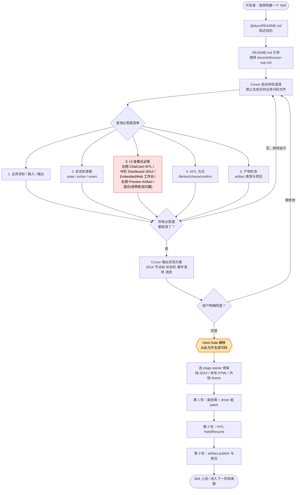

# Skill SOP Redesign Implementation Plan

> **For Claude:** REQUIRED SUB-SKILL: Use superpowers:executing-plans to implement this plan task-by-task.

**Goal:** Make the Skill development SOP visibly enforce a multi-round clarification Hard Gate before any Skill files are generated.

**Architecture:** This is a documentation-only change. `docs/README.md` becomes the entry router that sends Skill developers to `docs/skill/cursor-sop.md`; `cursor-sop.md` becomes the process source of truth with a Mermaid flowchart, Hard Gate, required UI ownership question, and post-gate implementation workflow.

**Tech Stack:** Markdown, Mermaid, existing Skill-First / SDUI documentation.

---

### Task 1: Update Skill Developer Entry In README

**Files:**
- Modify: `docs/README.md`

**Step 1: Read current Skill developer path**

Open `docs/README.md` and inspect the "Skill 开发者路径" section.

**Step 2: Move Cursor SOP to the first item**

Change the section so `docs/skill/cursor-sop.md` is item 1 and explicitly marked as the entry point.

Use this structure:

```markdown
## Skill 开发者路径（同事写阶段 Skill）

> **如果你（或你身后的 AI 助手）想“开发一个 Skill”，请先读 [`docs/skill/cursor-sop.md`](./skill/cursor-sop.md) 的 Hard Gate 段。**
>
> 在完成澄清必答题（含 **UI 挂载点必答**）并取得用户明确同意前，禁止生成任何 Skill 业务代码文件（`module.json` / `dashboard.json` / `driver.py` / `ui/*.html` 等）。
>
> Hard Gate 是本仓库 Skill 开发流程的最高优先级硬规则；其它文档（guide / protocol / dev-manual / starters）都是它需要时引用的参考资料。

按顺序阅读：

1. **Cursor SOP（用 AI 从零构建阶段 Skill，含 Hard Gate 与流程图）**
   - [`docs/skill/cursor-sop.md`](./skill/cursor-sop.md)

2. **阶段 Skill Starter（Hard Gate 解除后选骨架）**
   - [`docs/skill/stage-starters.md`](./skill/stage-starters.md)
   - 代码模板目录：仓库根的 `skill-starters/`

3. **Skill-First 接入规范（事件、HITL、EmbeddedWeb、边界铁律）**
   - [`docs/skill/guide.md`](./skill/guide.md)

4. **SDUI 协议（节点白名单、Action、Patch 约束）**
   - [`docs/sdui/protocol.md`](./sdui/protocol.md)

5. **实时 Patch 手册（syntheticPath/docId/revision 与推送姿势）**
   - [`docs/skill/dev-manual.md`](./skill/dev-manual.md)
```

**Step 3: Preserve unrelated sections**

Do not change:

- `## 平台维护者路径（协议/运行时/架构）`
- `## 设计与计划（Design / Plans）`

**Step 4: Verify markdown links**

Check that all relative links still point to existing files.

Expected:

- `./skill/cursor-sop.md`
- `./skill/stage-starters.md`
- `./skill/guide.md`
- `./sdui/protocol.md`
- `./skill/dev-manual.md`

---

### Task 2: Rewrite Cursor SOP Opening Flow

**Files:**
- Modify: `docs/skill/cursor-sop.md`

**Step 1: Keep title and intro**

Keep the title:

```markdown
# Cursor SOP：用 AI 快速构建阶段 Skill（Skill‑First / SDUI）
```

Keep or lightly edit the existing one-paragraph purpose statement so it still says the SOP helps business Skill developers use Cursor AI to build a runnable stage Skill.

**Step 2: Add the Mermaid flowchart after the intro**

Insert:

````markdown
## 总流程图：先澄清，后实现


````

**Step 3: Avoid emoji-only semantics**

The approved design used visual emphasis, but the actual docs should remain readable in plain text. If using emoji in headings, ensure the text still carries the meaning without it.

---

### Task 3: Add The Hard Gate Section

**Files:**
- Modify: `docs/skill/cursor-sop.md`

**Step 1: Insert the Hard Gate section after the flowchart**

Add:

```markdown
## Hard Gate：澄清未完成、用户未明确同意 → 严禁生成代码

> 本 SOP 的最高优先级硬规则。AI（Cursor / Claude / 其他）与人类协作者一律遵守。

### 适用范围

开发新阶段 Skill 或重构已有 Skill 的核心交互时，本 Hard Gate 即刻生效。

### Gate 解除前禁止的事

- 不得在 `~/.nanobot/workspace/skills/<name>/` 下创建任何文件（`module.json` / `data/dashboard.json` / `runtime/driver.py` / `ui/*.html` 等）
- 不得动业务代码（Python / TS / HTML / SQL / 配置 JSON）

允许做：读仓库文档、读 starter 与参考实现、问问题、给方案、画结构图、写伪代码。
```

**Step 2: Add the two unlock conditions**

Add the required table:

```markdown
### 解除 Gate 的两个充要条件

**条件 A — 完成澄清必答题清单（5 项缺一不可）**

| # | 必答题 | 收敛标准 |
|---|--------|----------|
| Q1 | 业务目标 / 输入 / 输出：本阶段做什么、数据从哪来、产出什么 | 1 段话能讲清 |
| Q2 | 状态机草案：state / action / 输出事件 | 列出所有 action 与对应事件 |
| Q3 | **UI 挂载点（必答，5 选 1 或明示混合）**：左侧 ChatCard / HITL 卡为主；中栏 Dashboard / 纯 SDUI 为主；EmbeddedWeb 工作台；右侧 PreviewPanel / Artifact 为主；混合（必须分栏说明每个交互归属） | 选项明确；混合需分栏写清楚 |
| Q4 | HITL 方式：file / text / choice / confirm 用哪些；resumeAction / onCancelAction 怎么填 | 列出请求类型与回流分支 |
| Q5 | 产物形态：是否 artifact.publish；产物类型；预览方式 | 明确“有/无 + 类型” |

若开发者说“先不管 Q4/Q5”，AI 必须把省略变成一次明确确认：

> 那我按 **无 HITL / 无 artifact** 落第一版骨架，确认吗？

**条件 B — 用户在对话里明确同意实现方案**

判定算同意：“确认 / OK / 同意 / 可以 / go / 按你说的来 / 动手吧”。
判定不算同意：“嗯 / 好”（追问“我按 [方案 X] 实现，确认吗？”）；带任何修改诉求（回澄清）；未回复（禁止主动开工）。
```

**Step 3: Add self-check and violation handling**

Add:

```markdown
### AI 自检清单（生成第一个文件前心算一遍）

- [ ] Q1-Q5 全部收敛？
- [ ] Q3（UI 挂载点）选项明确？
- [ ] 用户在最近一条消息里明确同意？
- [ ] 已读对应 starter 源码？
- [ ] 目标路径在 `~/.nanobot/workspace/skills/<name>/`？

任一为否 → 停下，回澄清。

### 违规即停

若 AI 在 Gate 未解除前已写文件：

1. 立即停止后续写入
2. 主动在对话里说明“我违反了 Hard Gate，已写入 N 个文件：[列表]”
3. 询问用户：删除回退？还是把已写文件作为草稿继续澄清？
```

---

### Task 4: Fold Existing Clarification Sections Into The Gate

**Files:**
- Modify: `docs/skill/cursor-sop.md`

**Step 1: Remove the old pre-work section**

Remove the old section:

```markdown
## 0. 开工前：开发者先准备“初步素材”
```

Its content is replaced by the Hard Gate required question table.

**Step 2: Replace the old clarification prompt with a sub-section**

Move the useful prompt into the Hard Gate section under:

```markdown
### AI 执行澄清的话术模板
```

Use this updated prompt:

```text
你是我们 Skill-First 平台的 Skill 开发助手。现在先不要写代码，也不要创建文件。

请你通过多轮访谈澄清我这个“阶段 Skill”的需求。每轮只问 1-2 个关键问题，直到下面 5 项全部收敛：
1) 业务目标 / 输入 / 输出
2) 状态机：state / action / 触发条件 / 输出事件
3) UI 挂载点（必答）：左侧 ChatCard/HITL、中栏 Dashboard/SDUI、EmbeddedWeb、右侧 Preview/Artifact，或混合并说明各自归属
4) HITL 方式：file/text/choice/confirm，或明确第一版无 HITL
5) 产物形态：artifact.publish 类型与预览方式，或明确第一版无 artifact

在 5 项收敛后，请先输出实现方案供我确认，包含：
- 业务目标（3-5 句）
- 输入/输出定义（输入来源、校验规则、产物清单与预览方式）
- 状态机表（state/action/触发条件/输出事件）
- UI 方案（交互归属 + SDUI 节点树草案，节点 id 稳定）
- 最小可运行 MVP 范围

在我明确回复“确认/同意/可以/动手吧”之前，不得生成任何业务代码文件。

我的阶段背景（尽量简短）：
- 阶段名称：<stage4_delivery>
- 阶段定义：<...>
- 状态机草案：<...>
- UI 草图：<...>
```

**Step 3: Replace old section 2 with post-gate input summary**

Replace:

```markdown
## 2. 基于澄清结果做选型与准备输入材料
```

with:

```markdown
## Gate 解除后：把澄清结果整理成实现输入

用户明确同意实现方案后，再把澄清结果整理成后续实现会用到的 5 样输入：

1. 阶段定义：本阶段做什么、输入是什么、输出产物是什么。
2. 状态机表：`state/action/触发条件/输出事件（dashboard.patch / hitl.* / artifact.publish）`。
3. UI 归属：左侧 ChatCard/HITL、中栏 Dashboard/SDUI、EmbeddedWeb、右侧 Preview/Artifact 的责任分配。
4. UI 节点清单：SDUI 节点树草案，所有可 patch 节点必须有稳定 `id`。
5. MVP 范围：第一轮只做“能挂载 + 能 patch”，后续再加 HITL 与 artifact。
```

---

### Task 5: Preserve And Retitle Post-Gate Implementation Sections

**Files:**
- Modify: `docs/skill/cursor-sop.md`

**Step 1: Keep starter section**

Keep the starter section content, but ensure wording says this happens after the Hard Gate clears:

```markdown
## 选一个 starter 当骨架（Hard Gate 解除后，不要从空文件开始）
```

**Step 2: Keep implementation prompt section**

Keep the implementation prompt section, but update its introduction to say it must only be used after explicit user approval.

**Step 3: Keep three-round delivery**

Keep:

- Round 1: mount + patch
- Round 2: HITL
- Round 3: artifact + preview

**Step 4: Keep EmbeddedWeb section**

Do not alter its technical details unless wording needs to reflect the UI ownership decision from the Hard Gate.

**Step 5: Add Hard Gate violation to common pitfalls**

Add one bullet:

```markdown
- **违反 Hard Gate**：澄清未完成、用户未明确同意前就创建 `module.json` / `dashboard.json` / `driver.py` / `ui/*.html`。一旦发生，立即停止并询问用户回退还是当草稿继续。
```

---

### Task 6: Validate The Documentation

**Files:**
- Validate: `docs/README.md`
- Validate: `docs/skill/cursor-sop.md`
- Validate: `docs/plans/2026-05-12-skill-sop-redesign-design.md`
- Validate: `docs/plans/2026-05-12-skill-sop-redesign-implementation.md`

**Step 1: Read the rendered markdown flow mentally**

Verify:

- README points to Cursor SOP first.
- Cursor SOP begins with the flowchart.
- Hard Gate appears before implementation instructions.
- The UI ownership question is mandatory.
- Starter selection appears only after the gate.

**Step 2: Check Mermaid syntax**

Mermaid block should begin with:

```markdown
```mermaid
flowchart TD
```
```

and end with a closing triple backtick.

**Step 3: Check link targets**

Confirm all relative paths are still valid:

- `./skill/cursor-sop.md`
- `./skill/stage-starters.md`
- `./skill/guide.md`
- `./sdui/protocol.md`
- `./skill/dev-manual.md`
- `../sdui/protocol.md`

**Step 4: Check no implementation files were touched**

This task must only modify documentation under `docs/`.

**Step 5: Git status review**

Run:

```bash
git status --short
```

Expected: only documentation changes relevant to this SOP redesign, plus any pre-existing unrelated worktree changes.

Do not commit unless the user explicitly asks.

