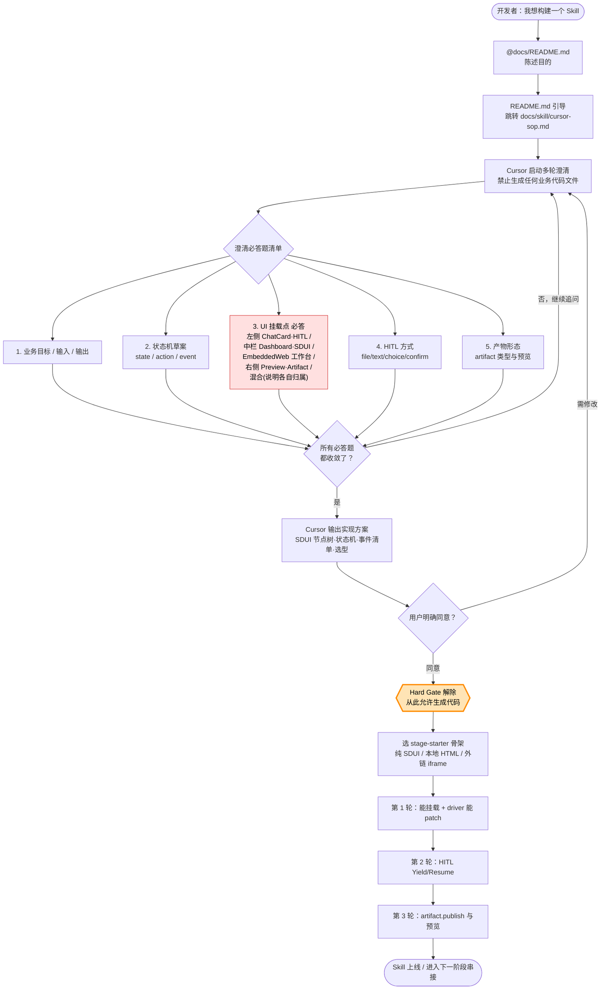

# Cursor SOP：用 AI 快速构建阶段 Skill（Skill‑First / SDUI）

本 SOP 面向“业务 Skill 开发同事”：用 Cursor 的 AI 协助，把你设计好的 **业务逻辑（状态机）** 与 **UI（SDUI/EmbeddedWeb）** 落到一个可运行的阶段 Skill。

> 目标：**从 0 到能跑**（能挂载模块大盘 + driver 能 patch + 可扩展到 HITL / 产物 / 串下一阶段）。  
> 约束：遵守 [`docs/skill/guide.md`](./guide.md) 的 Skill‑First 边界；遵守 [`docs/sdui/protocol.md`](../sdui/protocol.md) 的 SDUI 协议。

---

## 总流程图：先澄清，后实现



---

## ⛔ Hard Gate：澄清未完成、用户未明确同意 → 严禁生成代码

> 本 SOP 的最高优先级硬规则。AI（Cursor / Claude / 其他）与人类协作者一律遵守。

### 适用范围

开发新阶段 Skill 或重构已有 Skill 的核心交互时，本 Hard Gate 即刻生效。

### Gate 解除前禁止的事

- 不得在 `~/.nanobot/workspace/skills/<name>/` 下创建任何文件（`module.json` / `data/dashboard.json` / `runtime/driver.py` / `ui/*.html` 等）
- 不得动业务代码（Python / TS / HTML / SQL / 配置 JSON）
- 不得改平台前后端代码作为 Skill 实现的一部分

允许做：读仓库文档、读 starter 与参考实现、问问题、给方案、画结构图、写伪代码。

### 解除 Gate 的两个充要条件

**条件 A — 完成澄清必答题清单（5 项缺一不可）**

| # | 必答题 | 收敛标准 |
|---|--------|----------|
| Q1 | 业务目标 / 输入 / 输出：本阶段做什么、数据从哪来、产出什么 | 1 段话能讲清 |
| Q2 | 状态机草案：state / action / 输出事件 | 列出所有 action 与对应事件 |
| Q3 | ⭐ **UI 挂载点（必答，5 选 1 或明示混合）**：<br/>① 左侧 ChatCard / HITL 卡为主<br/>② 中栏 Dashboard / 纯 SDUI 为主<br/>③ EmbeddedWeb 工作台（中栏 iframe + postMessage）<br/>④ 右侧 PreviewPanel / Artifact 为主<br/>⑤ 混合（必须分栏说明每个交互归属） | 选项明确；混合需分栏写清楚 |
| Q4 | HITL 方式：file / text / choice / confirm 用哪些；resumeAction / onCancelAction 怎么填 | 列出请求类型与回流分支；或明确第一版无 HITL |
| Q5 | 产物形态：是否 artifact.publish；产物类型；预览方式 | 明确“有/无 + 类型” |

> 若开发者说“先不管 Q4/Q5”，AI 必须把省略变成一次明确确认：
>
> > 那我按 **无 HITL / 无 artifact** 落第一版骨架，确认吗？

**条件 B — 用户在对话里明确同意实现方案**

- 判定**算同意**：“确认 / OK / 同意 / 可以 / go / 按你说的来 / 动手吧”等明确肯定
- 判定**不算同意**：
  - “嗯 / 好”——AI 必须再追问一次“我按 [方案 X] 实现，确认吗？”
  - 带任何修改诉求——回到澄清环节
  - 未回复——禁止主动开工

### AI 自检清单（生成第一个文件前心算一遍）

- [ ] Q1-Q5 全部收敛？
- [ ] Q3（UI 挂载点）选项明确？
- [ ] 用户在最近一条消息里明确同意？
- [ ] 已读对应 starter 源码？
- [ ] 目标路径在 `~/.nanobot/workspace/skills/<name>/`？

任一为否 → 停下，回澄清。

### 违规即停

若 AI 在 Gate 未解除前已写文件：

1. 立即停止后续写入
2. 主动在对话里说明“我违反了 Hard Gate，已写入 N 个文件：[列表]”
3. 询问用户：删除回退？还是把已写文件作为草稿继续澄清？

### 附录：AI 执行澄清的话术模板

把下面这段直接发给 Cursor（把尖括号内容替换成你自己的）：

```text
你是我们 Skill-First 平台的 Skill 开发助手。现在先不要写代码，也不要创建文件。

请你通过多轮访谈澄清我这个“阶段 Skill”的需求。每轮只问 1-2 个关键问题，直到下面 5 项全部收敛：
1) 业务目标 / 输入 / 输出
2) 状态机：state / action / 触发条件 / 输出事件
3) UI 挂载点（必答）：左侧 ChatCard/HITL、中栏 Dashboard/SDUI、EmbeddedWeb、右侧 Preview/Artifact，或混合并说明各自归属
4) HITL 方式：file/text/choice/confirm，或明确第一版无 HITL
5) 产物形态：artifact.publish 类型与预览方式，或明确第一版无 artifact

在 5 项收敛后，请先输出实现方案供我确认，包含：
- 业务目标（3-5 句）
- 输入/输出定义（输入来源、校验规则、产物清单与预览方式）
- 状态机表（state / action / 触发条件 / 输出事件）
- UI 方案（交互归属 + SDUI 节点树草案，节点 id 稳定）
- 最小可运行 MVP 范围

在我明确回复“确认 / 同意 / 可以 / 动手吧”之前，不得生成任何业务代码文件。

我的阶段背景（尽量简短）：
- 阶段名称：<stage4_delivery>
- 阶段定义：<...>
- 状态机草案：<...>
- UI 草图：<...>
```

---

## Gate 解除后：把澄清结果整理成实现输入

用户明确同意实现方案后，再把澄清结果整理成后续实现会用到的 5 样输入：

1. **阶段定义**：本阶段做什么、输入是什么、输出产物是什么。
2. **状态机表**：`state / action / 触发条件 / 输出事件（dashboard.patch / hitl.* / artifact.publish）`。
3. **UI 归属**：左侧 ChatCard/HITL、中栏 Dashboard/SDUI、EmbeddedWeb、右侧 Preview/Artifact 的责任分配。
4. **UI 节点清单**：SDUI 节点树草案，所有可 patch 节点必须有稳定 `id`。
5. **MVP 范围**：第一轮只做“能挂载 + 能 patch”，后续再加 HITL 与 artifact。

---

## 选一个 starter 当骨架（Hard Gate 解除后，不要从空文件开始）

在仓库根 `skill-starters/` 选一个最接近你的阶段的 starter：

- **本地 HTML 工作台型**：`skill-starters/stage-starter-local-html/`
- **外链 iframe 型**：`skill-starters/stage-starter-external-web/`
- **纯 SDUI 型**：`skill-starters/stage-starter-native-sdui/`

把 starter 目录复制到本机：`~/.nanobot/workspace/skills/`，并把目录名改成你的 skill 名（例如 `stage4_delivery`）。

---

## 在 Cursor 里对 AI 的“实现指令模板”（建议照抄）

> 仅在 Hard Gate 解除（用户明确同意实现方案）后才使用本模板。

把下面这段直接发给 Cursor（把尖括号内容替换成你自己的）：

```text
我要实现一个新的阶段 Skill，遵守 Skill-First。

阶段技能名（目录名/moduleId）: <stage4_delivery>
docId: <dashboard:stage4-delivery>
UI 形态（选一项）: <纯SDUI | 本地HTML工作台 | 外链iframe>

业务目标（1-3 句）:
<...>

状态机（action -> 事件输出）:
- start: chat.guidance + dashboard.patch(初始化 Stepper/指标) + (如需输入则 hitl.* 并退出)
- <resume_after_xxx>: 校验 skill_runtime_result -> dashboard.patch -> ...
- publish: artifact.publish + dashboard.patch(100%)
- fallback_cancel: dashboard.patch(降级/终止)

UI 结构要点（节点 id 必须稳定）:
- Stepper id=stepper-main
- 指标区: StatisticRow id=stats-row，含 stat-progress/stat-status/...
- （如 EmbeddedWeb）id=<workbench-web> src=<...> state=<...>
- ArtifactGrid id=artifacts

请你基于仓库的 stage starter 修改以下文件，使其能跑通最小闭环（不做业务细节）:
- module.json
- data/dashboard.json
- runtime/driver.py
- (如本地HTML) ui/workbench.html

要求:
- driver 只通过 stdout NDJSON 输出事件信封，不要阻塞等待输入
- dashboard.patch 只做 by-id merge 叶子字段（遵守 SDUI Patch 约束）
- 不要修改前端/后端平台代码
```

这条指令的目标是：**让 AI 先把骨架跑通**，而不是一次性写完全部业务（业务细节在后续迭代中补齐）。

---

## 让 AI 分三轮交付（每轮都可运行/可验证）

### 第 1 轮：只做“能挂载 + 能 patch”

验收标准（必须全部满足）：

- 打开工作台能看到模块大盘（SDUI 渲染正常）
- driver 一启动就能 patch 一个 `Statistic` 或 `Markdown`（例如进度从 0% 到 30%）

### 第 2 轮：加入 HITL（文件/文本/选择/确认）

让 AI 按 [`docs/skill/guide.md`](./guide.md) 的 Yield/Resume 约束补：

- `hitl.file_request` / `hitl.text_request` / `hitl.choice_request` / `hitl.confirm_request`
- `requestId / resumeAction / onCancelAction` 全部齐全
- `fallback_cancel` 必须可安全执行

### 第 3 轮：加入产物与预览

让 AI 补：

- `artifact.publish` 发布产物索引（让右侧 PreviewPanel 能预览）
- 大盘 `ArtifactGrid` 里能看到发布的条目

---

## EmbeddedWeb（本地 HTML 工作台）专项 SOP

如果你的阶段是“本地 HTML 工作台型”，建议把这段要求加进对 AI 的指令：

- `dashboard.json` 的 `EmbeddedWeb.src` 使用：  
  `/api/file?path=workspace/skills/<skill>/ui/<page>.html`
- driver 用 `dashboard.patch` merge `EmbeddedWeb.state` 下发状态（JSON）
- HTML 内用 `window.parent.postMessage({ type: "skill_web_intent", payload: { action, data } }, "*")` 上行事件

---

## 常见踩坑（让 AI 避免）

- **违反 Hard Gate**：澄清未完成、用户未明确同意前就创建 `module.json` / `dashboard.json` / `driver.py` / `ui/*.html`。一旦发生，立即停止并询问用户回退还是当草稿继续。
- **模块挂载失败**：`module.json.dataFile` 不等于 `skills/<skill>/data/dashboard.json`
- **Patch 不生效/串台**：节点没 `id` 或 `docId/syntheticPath` 不一致
- **把业务逻辑写进平台**：违反 Skill‑First（见 [`docs/skill/guide.md`](./guide.md)）
- **用 Patch 改结构**：Patch M1 不允许改 `children/tabs`，只能 merge 叶子字段（见 [`docs/sdui/protocol.md`](../sdui/protocol.md)）
