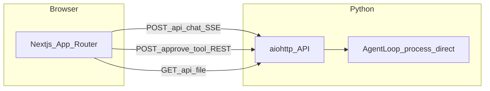

# Nanobot AGUI 设计规格书

**状态:** Draft → Review  
**日期:** 2025-03-24  
**关联蓝图:** [CURSOR_REFACTOR_PLAN.md](../../../CURSOR_REFACTOR_PLAN.md)（文内标题 AGUI_REFACTOR_PLAN）

---

## 1. 目标与范围

### 1.1 目标

- **前后端分离:** Python 侧仅提供 **REST + SSE** API；**不再**承担简陋原生 HTML UI 的服务职责。
- **保留核心:** 继续使用 Nanobot 现有 Agent 处理链路，以 [`nanobot/agent/loop.py`](../../../nanobot/agent/loop.py) 中的 `AgentLoop.process_direct` 为统一入口。
- **新前端:** 在仓库根目录新增 `frontend/`，采用 Next.js（App Router）+ Tailwind CSS + Lucide React；**禁止**使用外链 CDN；依赖一律 `npm install` 本地安装。

### 1.2 产品特性验收方向（摘自蓝图）

以下五项须在 Next.js 前端完整实现，本规格书主要约束 **后端 API / SSE 契约** 及与 `process_direct` 的集成方式；UI 细节见蓝图第 3 节。

1. 浏览器单页 **三栏布局**（侧栏 / 主对话 / 可选预览）。
2. **POST + SSE** 流式交互。
3. **Human-in-the-loop:** `ToolPending` → 用户确认 → `POST /api/approve-tool`。
4. **选择题模态框:** `RunFinished.choices` → Modal → 选项作为下一条用户消息。
5. **全格式文件分屏预览**（与 `GET /api/file` 及前端本地解析库配合）。

### 1.3 非目标（YAGNI）

- 本阶段不要求替换或删除 CLI、各 IM Channel；HTTP 网关为 **增量能力**。
- 不要求引入 Vercel AI SDK。
- 不要求将 SSE 改为 WebSocket（除非整体协议改版）。

---

## 2. 已确认架构决策（ADR 摘要）

| ID | 决策 | 内容 | 风险与演进 |
|----|------|------|------------|
| D1 | 部署与联调 | 开发期：Next.js（如 `localhost:3000`）与 Python API（如独立端口）**分进程**；通过 **CORS** 联调。生产可继续两进程部署。 | 需维护允许的 Origin 列表；生产应配置明确源，避免 `*` 与凭据混用（当前无鉴权，见 D3）。 |
| D2 | 会话标识 | **`threadId` 与 `session_key` 一一对应**；后端将请求体中的 `threadId` **原样**作为 `process_direct(..., session_key=threadId)`。 | 前端负责生成与持久化 `threadId`（如 `localStorage`）；与 Nanobot 既有 session 文件语义一致。 |
| D3 | 鉴权 | **暂不鉴权**；依赖内网隔离。 | 与 D6、无 Token API 叠加时，任意可达客户端影响大；生产或扩大网段后应升级为共享密钥或 SSO。 |
| D4 | run 标识 | **每次用户发送**由前端生成新的 **`runId`（建议 UUID）**；该次 `POST /api/chat` 的 SSE 全程及后续 `ToolPending` / `/api/approve-tool` 使用相同 `threadId` + `runId`。 | 多标签页各发各消息时 run 边界清晰；须配合 D5 避免同 thread 并发两跑。 |
| D5 | 同 thread 并发 | 若同一 `threadId` 上已存在 **未结束** 的 chat run，新的 `POST /api/chat` 返回 **HTTP 409 Conflict**（body 可为简短 JSON 说明）。不采用隐式排队（实现简单、语义明确）。 | 若未来需要队列，可改为 202 + 队列 ID，属协议变更。 |
| D6 | `/api/file` 路径范围 | **绝对路径:** 允许指向本机任意可读位置（内网 PoC，**不做**「必须在某根目录下」的沙箱校验）。**相对路径:** 与蓝图一致，解析为相对于 **Nanobot 工作区根目录**（与 Agent/工具所用 workspace 配置相同；实现时锚定现有配置项或 `cwd` 并写死在实现计划中）。 | 绝对路径任意访问风险仍存；演进方向为「仅允许 workspace 根下路径 + realpath」或「多根白名单」。 |
| D7 | HTTP 栈 | 新增 **`aiohttp`** 薄网关应用，注册 `/api/chat`、`/api/approve-tool`、`/api/file`；与蓝图一致。 | FastAPI/Starlette 可作为替代，但需同步改蓝图与依赖策略；本 spec 以 aiohttp 为准。 |

---

## 3. 系统架构



- **不推荐** 用 WebSocket 替代 SSE 完成同一套事件契约，除非前后端共同改版并更新本 spec。
- **数据流（聊天）:** 前端 `fetch` → `POST /api/chat` → aiohttp 启动后台任务调用 `process_direct`，将 `on_progress` / `on_stream` / `on_stream_end` 等回调 **映射** 为 SSE 事件写入响应流。

---

## 4. API 与 SSE 契约

### 4.1 `POST /api/chat`

- **Content-Type（响应）:** `text/event-stream`（SSE）。
- **请求体（JSON，最小字段）:**  
  `threadId`, `runId`, `messages`, `humanInTheLoop`（含义与蓝图一致）。**与 `process_direct` 的衔接:** 当前 `process_direct(content: str, ...)` 仅接受 **单条用户文本**；Step 1 假流可不解析 `messages`。接入真实 Agent 时，实现计划需约定：取 `messages` 中最后一条 user 文本作为 `content`，或扩展 loop 接受多轮历史（若未扩展，则须在 spec/计划中禁止依赖完整 `messages` 数组的语义）。
- **CORS:** 允许 Next 开发源（至少 `http://localhost:3000`），`OPTIONS` 预检需覆盖；允许头需包含 `Content-Type` 等前端实际发送的头。

### 4.2 SSE 帧格式

每条事件：

```text
event: <EventName>
data: <JSON 单行>

```

（空行分隔；JSON 为 UTF-8 单行、无未转义换行。）

### 4.3 事件类型与载荷

与 [CURSOR_REFACTOR_PLAN.md](../../../CURSOR_REFACTOR_PLAN.md) §2.2 对齐：

| event | data JSON 字段 |
|-------|----------------|
| `RunStarted` | `threadId`, `runId`, `model` |
| `StepStarted` | `stepName`: `"thinking"` \| `"tool"`, `text` |
| `TextMessageContent` | `delta` |
| `ToolPending` | `threadId`, `runId`, `toolCallId`, `toolName`, `arguments`（字符串，可为 JSON 字符串） |
| `RunFinished` | `threadId`, `runId`, `choices`（可选）, `message`（可选）, `error`（可选字段：成功路径 **省略**；SSE 已建立后的运行时错误路径 **必填**，形状 `{ "code", "message" }`，见 §4.4） |
| `Error` | `threadId`, `runId`, `code`（字符串）, `message`（人类可读） |

### 4.4 错误策略（写死）

- **请求不合法**（非 JSON、缺必填字段、JSON 过大等）: 返回 **HTTP 4xx**（如 400），**不**建立 SSE 体。
- **同 thread 并发冲突:** **HTTP 409**（见 D5）。
- **run 已结束或 runId 不匹配**（针对 `/api/approve-tool`）: **HTTP 404 或 409**（实现时选一种并在实现计划中写清；推荐 **404** 表示「无可恢复的挂起点」）。
- **成功路径:** 每次 `POST /api/chat` 的 SSE **必须以** `event: RunFinished` **结束**（可带 `message` / `choices`，**不带** `error`）。
- **Agent / LLM / 运行时错误**（在 SSE 已开始后）: 发送 **`event: Error`**（载荷见 §4.3 表），随后 **必须** 再发送 **`event: RunFinished`**，且 `RunFinished` **必须** 包含 **`"error": { "code", "message" }`**（与 `Error` 事件同源信息，便于只监听 `RunFinished` 的客户端）。禁止仅以 `Error` 结束流而不发送 `RunFinished`。成功路径下 `RunFinished` **不得** 带 `error` 字段（或 `error` 为 null，实现计划二选一写死）。

### 4.5 `POST /api/approve-tool`

- **请求体:** `threadId`, `runId`, `toolCallId`, `approved`（boolean）。
- **语义:** 解析当次 run 内挂起的 `asyncio.Future`（或等价同步原语），`approved=true` 继续执行，`false` 取消或返回工具失败（具体与 Agent 工具层约定，在 Step 4 实现时细化）。
- **Step 1:** 可 **stub**（如 501 或空操作），与蓝图「先假 SSE」一致。

### 4.6 `GET /api/file?path=...`

- **路径清洗:** 将 `\` 转为 `/`，去除 `\r\n` 等控制污染；与蓝图一致。
- **范围:** 见 D6：**绝对路径** 任意可读；**相对路径** 相对于工作区根（与蓝图「相对 workspace」一致）。
- **响应:** 按后缀设置 `Content-Type`；大文件 **后续** 可改为流式读取（本 spec 标为后续优化，首版可用简单读入）。

---

## 5. 与 `process_direct` 的映射原则

锚点：[`nanobot/agent/loop.py`](../../../nanobot/agent/loop.py) — `process_direct` → `_process_message` → `_run_agent_loop`。

| SSE / 行为 | 来源（原则） |
|------------|----------------|
| `TextMessageContent.delta` | `on_stream` 增量（已过滤 think 标签后的可见文本） |
| `StepStarted` thinking | `on_progress(text)` 且 **非** `tool_hint` |
| `StepStarted` tool | `on_progress(..., tool_hint=True)` 时的工具提示文案 |
| `RunStarted.model` | 默认取 **`AgentLoop` 当前配置的模型**；若请求体将来支持 `model` 字段覆盖，优先级为：**请求体 > 环境/配置**（在实现计划中写死；Step 1 假流可用固定字符串）。 |
| `ToolPending` / `RunFinished` / HITL | Step 4–5 在工具执行链插入挂起点后与蓝图对齐；本 spec 仅约束事件形状 |

实现阶段需逐行对照 `_run_agent_loop` 中 `on_stream` / `on_stream_end` / `on_progress` 的调用时机，避免与 CLI 行为冲突。

---

## 6. 后端依赖

- 新增 **`aiohttp`**（版本约束写入 [`pyproject.toml`](../../../pyproject.toml)），具体版本在 **步骤 1 实现** 时确定并与 Python 3.11+ 兼容。

---

## 7. 分阶段验收（与蓝图步骤对齐）

| 蓝图步骤 | 内容 | 本 spec 覆盖 |
|----------|------|----------------|
| Step 1 | 后端 API + 假 SSE + CORS | API 形状、SSE 契约、错误策略、409 规则、CORS 要求 |
| Step 2 | 前端初始化 + `useAgentChat` | 依赖前端按契约解析 SSE |
| Step 3 | 三栏 UI | 以蓝图 §3 为准 |
| Step 4 | HITL | `ToolPending`、`/api/approve-tool` 语义 |
| Step 5 | Choices Modal | `RunFinished.choices` |
| Step 6 | 文件预览 | `GET /api/file` + 前端库 |

本文件作为 **Step 1–6** 的共有约束；**Step 1 完成后** 应用假数据验证 `RunStarted` → `TextMessageContent` → `RunFinished` 与 CORS。

---

## 8. 参考与修订

- 蓝图: [CURSOR_REFACTOR_PLAN.md](../../../CURSOR_REFACTOR_PLAN.md)
- 代码锚点: [`nanobot/agent/loop.py`](../../../nanobot/agent/loop.py) — `process_direct`, `_run_agent_loop`

### Revision

- **2025-03-24:** 初稿；首轮 review 指出 `RunFinished.error` 与 D6/蓝图路径表述后已修订；二轮 review **Approved**；采纳 advisory 显式化「成功路径以 RunFinished 结束」及表中 `error` 说明。
