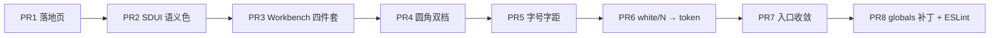

# 视觉规范修订单 v1

> 版本：v1.0  ·  范围：仅前端视觉呈现  ·  发布日期：2026-05-05  ·  目标分支：所有

---

## 0 · 总则与不变量

### 0.1 适用范围

本规范覆盖 [`frontend/`](frontend/) 下所有与视觉呈现相关的代码与样式：

- `frontend/app/**/*.{tsx,css}`
- `frontend/components/**/*.tsx`
- `frontend/lib/**/*.ts`（仅样式 token / className 常量部分，如 [`frontend/lib/sidebarTokens.ts`](frontend/lib/sidebarTokens.ts)、[`frontend/components/sdui/sduiSemanticColor.ts`](frontend/components/sdui/sduiSemanticColor.ts)）

### 0.2 不变量（本次重构零改动）

下列条目在 v1 推动的所有 PR 中**严禁修改**，违者必须打回：

| 类别 | 不变量 |
|---|---|
| 后端契约 | `/api/*` 的所有路由、请求/响应字段、SSE event 格式 |
| 协议层 | `docs/sdui-protocol-spec.md`、`docs/sdui-v3-schema.json`、`docs/hybrid-mode-protocol.md` 全部内容 |
| 运行时 | [`frontend/hooks/useAgentChat.ts`](frontend/hooks/useAgentChat.ts) 行为、[`frontend/components/sdui/SkillUiRuntimeProvider.tsx`](frontend/components/sdui/SkillUiRuntimeProvider.tsx) 接口 |
| 鉴权与路由 | [`frontend/lib/authStore.ts`](frontend/lib/authStore.ts)、[`frontend/lib/authFetch.ts`](frontend/lib/authFetch.ts)、Next.js 路由结构 |
| Token 定义 | [`frontend/app/globals.css`](frontend/app/globals.css) 中 `--surface-*` / `--text-*` / `--accent` / `--shadow-*` / `--motion-*` / `--border-*` 等 CSS 变量值 |
| 三主题 | `data-theme="dark"` / `"light"` / `"soft"` 三套色板的相对关系 |

> v1 仅"严格执行"已存在的 token 体系，不引入新的颜色或字号原子；§5 PR8 中允许在 globals.css 追加少量 utility 类（`.ui-btn-destructive`）以及补全 `--success-bg / --warning-bg / --success-border / --warning-border` 四个 token，但必须基于已有 CSS 变量组合而成、且与现有三主题分别配套。

### 0.3 术语对齐

- **Token**：定义在 [`frontend/app/globals.css`](frontend/app/globals.css) 顶部 `:root` / `[data-theme=...]` 块中的 CSS 自定义属性，以及紧跟其后定义的 `.ui-*` utility 类。
- **Surface**：作为可视化层级载体的元素背景，如 sidebar、chat 面板、card、modal、drawer。
- **控件级**：button、input、chip、menu-item、badge、pill 等可点击/可输入的小型 UI 原子。
- **面板级**：包含至少一个控件、并构成独立视觉单元的容器，如 card、modal body、drawer、sidebar、chat 列。
- **浮层**：脱离文档流、覆盖在主内容之上的元素，如 modal、drawer、popover、toast、command palette、search overlay。

---

## 1 · 设计原则（5 条）

### P1 · 单一来源原则（Single Source of Truth）

颜色、字号、阴影、圆角、动效时长**必须**经过 token 系统。任何业务文件中出现 raw 数值（`text-[12px]`、`bg-white/[0.04]`、`shadow-[0 2px 8px ...]`、`transition-duration: 200ms`）都视为违例。

> 例外：仅 `globals.css` 内部允许定义 token 与 utility class，此时可使用具体数值。

### P2 · 一种纹理原则（Single Texture）

任一 surface 元素只允许使用以下 4 种"纹理"中的**一种**：

```
border  |  ring (1px box-shadow)  |  drop shadow  |  inset highlight
```

禁止四件套同时上身。globals.css 注释里已写过这条约束（`/* 规则：一个元素只允许使用一种 elevation */`），v1 是把这条约束**强制铺到业务代码**。

> 推荐：直接使用 `.ui-elevation-0..4`，已经预设了正确的纹理组合。

### P3 · 双档圆角原则（Two-Step Radius）

全仓只允许 3 种圆角：

| 用途 | 类 | 像素 |
|---|---|---|
| 控件级 | `rounded-lg` | 8px |
| 面板级 | `rounded-2xl` | 16px |
| 圆形 | `rounded-full` | 9999px |

例外白名单：preview drawer 浸入态使用 `rounded-[1.4rem]`（22.4px）作为"重要浮层"区分，全仓不超过 2 处。

### P4 · 语义颜色优先原则（Semantic over Palette）

需要表达"成功 / 失败 / 警告 / 进行中 / 强调"的视觉语义时，**只能**使用：

```
--success / --warning / --danger / --accent
--success-bg / --danger-bg / --accent-bg-soft / --accent-soft / --danger-border ...
```

禁止直写 Tailwind palette（`text-red-400`、`bg-emerald-500/10`、`ring-sky-400/30`）。三主题切换时 palette 不会跟随，token 会。

### P5 · 入口收敛原则（Entry Convergence）

同一行为不在同一视图内提供超过 2 个入口；同一菜单不混合"工作台动作 / 系统设置 / 危险操作"三类。menu item 文案优先 2–4 字 + 右侧 hint，避免完整句子。

---

## 2 · Token 准用 / 禁用清单

> 本章是 v1 最重要的执行依据。每个小节给出"准用"列表、"禁用"列表、以及一两条**最有代表性的违例示例 + 修订写法**。

### 2.1 Surface（背景）

#### 准用

| Token | 用途 |
|---|---|
| `--surface-0` | 应用最底层（body / html 背景） |
| `--paper-chat` | Chat 列、ChatBubble 容器 |
| `--canvas-rail` | 左侧导航 rail、preview drawer 容器 |
| `--surface-1` | 默认 panel / sidebar 内卡片 |
| `--surface-2` | 二级嵌套（panel 内的 input bar 等） |
| `--paper-card` | dashboard 列、SDUI Card |
| `--surface-3` | 三级嵌套（input field 内部） |
| `--surface-elevated` | 浮层（modal / drawer / dropdown） |

或直接使用 utility：`.ui-elevation-0`（裸 surface）/ `.ui-elevation-1`（hairline ring）/ `.ui-elevation-2`（card 阴影）/ `.ui-elevation-3`（panel 阴影）/ `.ui-elevation-4`（float 阴影）。

#### 禁用

```
bg-white/[0.0X]        bg-white/X        bg-black/[0.X]        bg-black/X
dark:bg-white/[0.0X]   dark:bg-black/X
bg-{slate|zinc|gray|neutral|stone}-NN  作为 surface 用途
```

#### 典型违例 → 修订

[`frontend/components/ChatInput.tsx:56-66`](frontend/components/ChatInput.tsx)

```diff
- "overflow-hidden rounded-2xl border border-[var(--border-subtle)] bg-[var(--surface-1)]/90 ... dark:bg-[var(--surface-1)] dark:shadow-[inset_0_1px_0_rgba(255,255,255,0.04)] dark:ring-1 dark:ring-white/[0.08] ..."
+ "ui-elevation-2 rounded-2xl"
```

[`frontend/app/LandingClient.tsx:191`](frontend/app/LandingClient.tsx)

```diff
- "... border border-[var(--border-strong)] bg-white/[0.03] ... shadow-[inset_0_1px_0_rgba(255,255,255,0.05)] ..."
+ "... ui-btn-accent ui-btn-sheen rounded-lg ..."
```

### 2.2 Border / Ring（描边与外环）

#### 准用

```
border-[var(--border-subtle)]   border-[var(--border-strong)]
ring-1 ring-[var(--border-subtle)]
.ui-elevation-1                  /* box-shadow: 0 0 0 1px var(--border-subtle) */
focus-visible:ring-[var(--interactive-focus-ring)]
```

#### 禁用

```
border-white/N            border-black/N            border-{palette}-NN
ring-white/N              ring-black/N              ring-{palette}-NN
dark:border-white/N       dark:ring-white/N
```

#### 典型违例 → 修订

[`frontend/app/workbench/WorkbenchContent.tsx:1795`](frontend/app/workbench/WorkbenchContent.tsx)

```diff
- "dashboard-container ... rounded-2xl border-l border-white/5 bg-[var(--paper-card)] shadow-[var(--shadow-card)]"
+ "dashboard-container ... rounded-2xl border-l border-[var(--border-subtle)] bg-[var(--paper-card)] shadow-[var(--shadow-card)]"
```

[`frontend/app/workbench/WorkbenchContent.tsx:1600`](frontend/app/workbench/WorkbenchContent.tsx)

```diff
- "w-11 shrink-0 ... rounded-l-2xl border-r border-white/5 bg-[var(--canvas-rail)] ..."
+ "w-11 shrink-0 ... rounded-l-2xl border-r border-[var(--border-subtle)] bg-[var(--canvas-rail)] ..."
```

### 2.3 文字（颜色 / 字号 / 字距）

#### 文字颜色 · 准用

```
ui-text-primary    ui-text-secondary    ui-text-muted
text-[var(--accent)]
text-[var(--success)] / text-[var(--warning)] / text-[var(--danger)]
```

#### 文字颜色 · 禁用

```
text-{slate|zinc|gray|neutral|stone}-NN
text-{red|emerald|sky|amber|orange|yellow|green|blue}-NN
text-{...}-NN/N    （含透明度变种）
text-white   text-black   （除非在 .ui-btn-accent 内已经预设）
```

#### 字号 · 准用

| 类 | 像素 | 用途 |
|---|---|---|
| `.ui-text-eyebrow` | 10px / 700 / tracking 0.12em / uppercase | 段落标签、章节眉 |
| `.ui-text-label` | 11px | 副信息、metadata |
| `.ui-text-body` | 12px | 默认正文（聊天气泡、菜单 item、正文） |
| `.ui-text-title` | 14px / 600 | 卡片标题、modal 标题、面板标题 |

外加 Tailwind 标准档位（仅用于 hero 与长篇 markdown body）：

```
text-base     text-lg      text-xl      text-2xl    text-3xl
text-4xl      text-5xl     text-7xl     xl:text-[8.5rem]   ← hero 唯一像素 token
```

#### 字号 · 禁用

```
text-[10px]   text-[11px]   text-[12px]   text-[13px]   text-[14px]   text-[7px]
text-[Npx]    text-[N.NNrem]   （除上面白名单的 8.5rem）
```

#### 字距 · 准用

```
（默认）  tracking-tight   tracking-wide
.ui-text-eyebrow 已内置 tracking 0.12em，使用类即可
```

#### 字距 · 禁用

```
tracking-[0.12em]   ← 应改用 .ui-text-eyebrow
tracking-[0.16em]   ← 应改用 .ui-text-eyebrow
tracking-[0.20em]   ← 全仓禁用，副标题不应有此字距
tracking-[0.30em]   ← 全仓禁用
```

#### 典型违例 → 修订

[`frontend/app/LandingClient.tsx:187`](frontend/app/LandingClient.tsx)

```diff
- <p className="mb-12 max-w-2xl text-base font-medium tracking-[0.2em] ui-text-muted md:text-lg">数据驱动决策，行动引领未来。</p>
+ <p className="mb-10 max-w-2xl text-lg ui-text-secondary md:text-xl">数据驱动决策，行动引领未来。</p>
```

[`frontend/components/dashboard/ProjectOverview.tsx:41`](frontend/components/dashboard/ProjectOverview.tsx)

```diff
- <div className="text-2xl font-semibold tracking-[0.3em] opacity-30">PLAN</div>
+ <div className="text-2xl font-semibold ui-text-muted opacity-50">PLAN</div>
```

[`frontend/lib/sidebarTokens.ts:7`](frontend/lib/sidebarTokens.ts)

```diff
- export const SIDEBAR_SECTION_LABEL_CLASS = "text-[10px] font-medium tracking-[0.16em] ui-text-muted";
+ export const SIDEBAR_SECTION_LABEL_CLASS = "ui-text-eyebrow ui-text-muted";
```

### 2.4 语义色（success / warning / danger / accent）

#### 准用

```
文字： text-[var(--success)]   text-[var(--warning)]   text-[var(--danger)]   text-[var(--accent)]
背景： bg-[var(--success-bg)]?  bg-[var(--danger-bg)]   bg-[var(--accent-bg-soft)]   bg-[var(--accent-soft)]
描边： border-[var(--danger-border)]   border-[var(--accent-border)]
组合： .ui-status-success / .ui-status-warning / .ui-status-danger / .ui-status-running
按钮： .ui-btn-danger-soft   （PR8 后追加 .ui-btn-destructive）
```

> 备注：globals.css 当前已定义 `--danger-bg / --danger-border / --danger-fg`，但**未**定义 `--success-bg / --warning-bg`。PR8 中将补全（仅追加，不动既有定义）。

#### 禁用

```
text-red-NN    text-red-NN/N
text-emerald-NN   text-green-NN   text-yellow-NN   text-amber-NN
text-sky-NN    text-blue-NN
bg-red-NN/N    bg-emerald-NN/N   bg-amber-NN/N   bg-yellow-NN/N
ring-red-NN/N  ring-emerald-NN/N
```

#### 典型违例 → 修订

[`frontend/app/workbench/WorkbenchContent.tsx:237-241`](frontend/app/workbench/WorkbenchContent.tsx)

```diff
- <p className="px-2 pb-1 text-[10px] font-medium uppercase tracking-wider text-red-300">危险操作</p>
- <button className="w-full rounded-lg bg-red-500/10 px-2.5 py-2.5 text-left text-sm font-medium text-red-400 ring-1 ring-red-500/25 transition-colors hover:bg-red-500/20" ...>
+ <p className="px-2 pb-1 ui-text-eyebrow ui-status-danger">危险操作</p>
+ <button className="ui-btn-destructive w-full rounded-lg px-2.5 py-2.5 text-left text-sm font-medium" ...>
```

[`frontend/app/workbench/WorkbenchContent.tsx:183`](frontend/app/workbench/WorkbenchContent.tsx)

```diff
- className={navExpanded ? "shrink-0 text-emerald-400/90" : "shrink-0 ui-text-muted"}
+ className={navExpanded ? "shrink-0 ui-status-success" : "shrink-0 ui-text-muted"}
```

[`frontend/components/StepLogs.tsx:199-216`](frontend/components/StepLogs.tsx)

```diff
- "border-red-500/20 bg-red-500/10 text-red-400 ring-1 ring-red-500/20 "
+ "border-[var(--danger-border)] bg-[var(--danger-bg)] text-[var(--danger-fg)] ring-1 ring-[var(--danger-border)] "
```

[`frontend/components/sdui/sduiSemanticColor.ts`](frontend/components/sdui/sduiSemanticColor.ts) 整文件按下表替换（PR2 主刀对象）：

| 原 | 改 |
|---|---|
| `text-green-600 dark:text-green-400` | `text-[var(--success)]` |
| `text-yellow-600 dark:text-yellow-400` | `text-[var(--warning)]` |
| `text-red-600 dark:text-red-400` | `text-[var(--danger)]` |
| `text-blue-600 dark:text-blue-400` | `text-[var(--accent)]` |
| `text-slate-500 dark:text-slate-400` | `ui-text-muted` |
| `bg-green-500` / `bg-red-500` / ... | `bg-[var(--success)]` / `bg-[var(--danger)]` / ... |

### 2.5 圆角

#### 准用

```
rounded-lg     /* 8px - 控件级 */
rounded-2xl    /* 16px - 面板级 */
rounded-full   /* 9999px - 圆形 */
rounded-l-2xl rounded-r-2xl rounded-t-2xl rounded-b-2xl
                /* 单边面板，限 sidebar / drawer 三处使用 */
```

#### 例外白名单（全仓不超过 3 处）

```
rounded-[1.4rem]   ← 仅 frontend/app/workbench/WorkbenchContent.tsx:1864-1865
                     的 preview drawer 浸入态 / 抽屉态
```

#### 禁用

```
rounded-md     ← 一律 → rounded-lg
rounded-xl     ← 一律 → rounded-lg（控件）或 rounded-2xl（面板）
rounded-3xl    ← 一律 → rounded-2xl
rounded-[Xpx]  rounded-[Xrem]   （除白名单）
```

> 选型规则：button / input / chip / icon-pill / menu-item / tab → `rounded-lg`；card / modal / drawer / sidebar / panel / chat-bubble → `rounded-2xl`。

### 2.6 阴影

#### 准用

```
shadow-[var(--shadow-card)]      shadow-[var(--shadow-panel)]      shadow-[var(--shadow-float)]
shadow-sm                         shadow-none
.ui-elevation-2 / -3 / -4         （内置阴影 + inset highlight）
.ui-sheet                         （内置 shadow-float + inset highlight）
```

#### 禁用

```
shadow-[inset_0_1px_0_...]                ← 自拼 inset highlight
shadow-[inset_1px_0_0_...,inset_-1px_0_0_...,inset_0_1px_0_...]   ← 四面 inset 假描边
shadow-[0_1px_4px_rgba(...)]              ← 自拼环境光
shadow-xl    shadow-2xl                   ← Tailwind 默认阴影
dark:shadow-[inset_...]                   ← 任何形式的 dark inset 拼装
```

#### 典型违例 → 修订

[`frontend/app/workbench/WorkbenchContent.tsx:1699`](frontend/app/workbench/WorkbenchContent.tsx)

```diff
- "flex min-h-0 ... shadow-[var(--shadow-panel)] dark:border-0 dark:shadow-[inset_1px_0_0_rgba(255,255,255,0.05),inset_-1px_0_0_rgba(255,255,255,0.05),inset_0_1px_0_rgba(255,255,255,0.03)]"
+ "ui-elevation-2 flex min-h-0 ..."
```

[`frontend/app/workbench/WorkbenchContent.tsx:1864-1865`](frontend/app/workbench/WorkbenchContent.tsx)

```diff
- "... rounded-[1.4rem] border border-[var(--border-subtle)] bg-[var(--canvas-rail)] p-2 shadow-2xl"
+ "ui-sheet ... rounded-[1.4rem] bg-[var(--canvas-rail)] p-2"
```

[`frontend/app/landing.module.css:181`](frontend/app/landing.module.css)

```diff
- box-shadow: 0 1px 0 rgba(255, 255, 255, 0.2) inset;   /* .go 提交按钮内高光 */
+ /* 移除：accent fill 已经足够，刺眼内高光导致按钮顶端有亮线 */
```

### 2.7 动效

#### 准用

```
.ui-motion              /* 基础 200ms ease-out */
.ui-motion-fast         /* 120ms */
.ui-motion-slow         /* 320ms */
.transition-standard    /* 兼容别名，与 .ui-motion 等价 */
transition-property/duration 走 var(--motion-fast/-base/-slow) + var(--ease-out)
```

#### 禁用

```
duration-150  duration-200  duration-300  duration-500       ← Tailwind 直写
duration-[220ms]   duration-[180ms]                          ← 任意像素时长
transition-duration: 0.15s / 0.25s / 0.34s                   ← CSS 内联魔法数
```

#### 典型违例 → 修订

[`frontend/app/workbench/WorkbenchContent.tsx:138`](frontend/app/workbench/WorkbenchContent.tsx)

```diff
- "ui-motion flex w-full items-center gap-2.5 rounded-lg ... transition-colors duration-[220ms] ease-out hover:bg-[var(--surface-3)]"
+ "ui-motion-fast flex w-full items-center gap-2.5 rounded-lg ... hover:bg-[var(--surface-3)]"
```

### 2.8 一种纹理（Single Texture, 关键约束）

#### 规则

任一 surface 元素只能选用以下 4 种"纹理"之一：

| 纹理 | 实现 |
|---|---|
| 仅 surface | 仅 `bg-[var(--surface-N)]`，无 border、无 shadow |
| hairline ring | `.ui-elevation-1`（box-shadow `0 0 0 1px`） |
| drop shadow | `shadow-[var(--shadow-card)]` 或 `.ui-elevation-2` |
| float | `shadow-[var(--shadow-float)]` 或 `.ui-elevation-4` / `.ui-sheet` |

> 推荐做法：直接使用 `.ui-elevation-N` 或 `.ui-sheet`，不要手摆 `border + shadow + ring + inset` 组合。

#### 典型违例（四件套同时上身）

[`frontend/app/workbench/WorkbenchContent.tsx:1697-1700`](frontend/app/workbench/WorkbenchContent.tsx)：chat 列同时叠加 `border + shadow-panel + dark:border-0 + dark:shadow-[inset_1px,inset_-1px,inset_0_1px]`，三主题下渲染逻辑分裂、视觉混乱。修订写法见 §2.6。

[`frontend/components/ChatInput.tsx:56-61`](frontend/components/ChatInput.tsx) `fusedShellClass`：同时使用 `border + shadow + dark:shadow + dark:ring + supports-[backdrop-filter]:backdrop-blur` 五种纹理。修订：

```diff
- "overflow-hidden rounded-2xl border border-[var(--border-subtle)] bg-[var(--surface-1)]/90 shadow-[var(--shadow-card)] transition-shadow focus-within:ring-1 focus-within:ring-[color-mix(in_srgb,var(--accent)_28%,transparent)] supports-[backdrop-filter]:backdrop-blur-md dark:border-white/10 dark:bg-[var(--surface-1)] dark:shadow-[inset_0_1px_0_rgba(255,255,255,0.04)] dark:ring-1 dark:ring-white/[0.08] supports-[backdrop-filter]:dark:backdrop-blur-sm dark:focus-within:ring-1 dark:focus-within:ring-[color-mix(in_srgb,var(--accent)_30%,transparent)]"
+ "ui-elevation-2 overflow-hidden rounded-2xl transition-shadow focus-within:ring-1 focus-within:ring-[color-mix(in_srgb,var(--accent)_28%,transparent)]"
```

---

## 3 · 组件层规范

> §2 是底层原子规则；§3 是常见组件的"成品规范"，所有组件都应基于 §2 token 组合。

### 3.1 Button

#### 形态枚举

| 形态 | 类组合 | 用途 |
|---|---|---|
| Primary | `.ui-btn-accent rounded-lg h-9 px-4` | 表单提交、主要 CTA |
| Primary Hero | `.ui-btn-accent .ui-btn-sheen rounded-lg h-11 px-6` | 落地页 / onboarding 主按钮，全仓不超过 3 处 |
| Ghost | `.ui-btn-ghost rounded-lg h-9 px-3` | 次要操作、icon-only 头部按钮 |
| Outline | `border border-[var(--border-subtle)] bg-transparent ui-text-secondary hover:bg-[var(--interactive-hover-bg)] rounded-lg h-9 px-3` | 取消、关闭、辅助操作 |
| Destructive Soft | `.ui-btn-destructive rounded-lg h-9 px-3` | 删除、清空、移出（PR8 新增类） |

> `.ui-btn-destructive` 由 PR8 在 globals.css 追加，定义为：
>
> ```css
> .ui-btn-destructive {
>   background: var(--danger-bg);
>   color: var(--danger-fg);
>   border: 1px solid var(--danger-border);
>   transition: background-color var(--motion-fast) var(--ease-out);
> }
> .ui-btn-destructive:hover {
>   background: color-mix(in oklab, var(--danger-bg) 70%, var(--danger) 18%);
> }
> ```

#### 尺寸

| 名 | 高度 | 内边距 | 字号 |
|---|---|---|---|
| Default | h-9 (36px) | px-4 | text-sm |
| Compact | h-8 (32px) | px-3 | text-xs |
| Hero | h-11 (44px) | px-6 | text-sm font-medium |
| Icon-only | h-9 w-9 | p-0 | — |

> 全仓禁止 `h-7 / h-10 / h-12` 自定义按钮高度，统一上述四档。

#### 禁用做法

- 在 button 上同时 `border + ring + shadow + inset highlight`（违反 §2.8）。
- 用 raw palette 做 destructive：`bg-red-500/10 text-red-400 ring-red-500/25`（违反 §2.4）。
- `transition: all` 不指定属性，导致 hover 时位移 / scale 跟随渐变（应只过渡 `background-color, border-color, color`）。

### 3.2 Input / TextArea / Select

#### 形态

| 名 | 类组合 |
|---|---|
| Field | `.ui-input .ui-input-focusable rounded-lg h-9 px-3 text-sm w-full` |
| TextArea | `.ui-input .ui-input-focusable rounded-lg p-3 text-sm w-full` |
| Select（自定义） | `.ui-input .ui-input-focusable rounded-lg h-9 pl-3 pr-8 text-sm` |
| Ghost Select（顶栏 / 模型条） | `bg-transparent border-0 ring-0 px-2 py-1 text-xs ui-text-secondary hover:bg-[var(--interactive-hover-bg)] rounded-md` |

> Ghost Select 是唯一允许使用 `rounded-md` 的场景例外（一行内嵌的弱化 select，使用 `rounded-lg` 视觉过重）。**追加白名单：仅 `frontend/components/ChatInput.tsx` 模型条与 `WorkbenchContent.tsx` 顶栏 select。**

#### 焦点行为

- 焦点环只能用 `.ui-input-focusable` 内部的 `box-shadow: 0 0 0 2px color-mix(in srgb, var(--accent) 38%, transparent)`。
- 禁止：`focus:border-{palette}-NN`、`focus:ring-{palette}-NN`、`focus:scale-NN`、`focus:translate-y-N`。

### 3.3 浮层（Modal / Drawer / Toast / Menu / Popover）

#### 通用规则

- 容器：`.ui-sheet` 或 `.ui-elevation-3/4`。
- 圆角：`rounded-2xl`（preview drawer 浸入态例外 `rounded-[1.4rem]`）。
- backdrop-filter blur 上限 **8px**。当前 `frontend/app/landing.module.css:42-44` 的 `blur(24px)` 必须降到 8px。
- 关闭按钮：右上角 32×32，`.ui-btn-ghost rounded-lg`，icon `lucide:X size=16`。
- 标题：`.ui-text-title`（14px / 600）；副标题：`.ui-text-label ui-text-secondary`。

#### 出场动效

- Modal 出场：`opacity 0 → 1` + `translateY(8px → 0)`，时长 `--motion-base`。
- Drawer 出场：`translateX(100% → 0)`，时长 `--motion-base`。
- Toast 出场：`opacity 0 → 1` + `translateY(8px → 0)`，时长 `--motion-fast`。
- 禁止 scale 转场（除非视觉故意"弹出"，如命令面板，可用 `scale(0.96 → 1)`）。

#### 典型违例 → 修订

[`frontend/app/landing.module.css:42-44`](frontend/app/landing.module.css)

```diff
- backdrop-filter: blur(24px);
- -webkit-backdrop-filter: blur(24px);
+ backdrop-filter: blur(8px);
+ -webkit-backdrop-filter: blur(8px);
```

[`frontend/app/workbench/WorkbenchContent.tsx:174`](frontend/app/workbench/WorkbenchContent.tsx) WorkbenchTools 菜单：

```diff
- "supports-[backdrop-filter]:backdrop-blur-md supports-[backdrop-filter]:dark:backdrop-blur-xl"
+ "supports-[backdrop-filter]:backdrop-blur-md"
```

> （`backdrop-blur-xl` ≈ 24px，超过 8px 上限。）

### 3.4 ChatBubble & Card

#### ChatBubble（消息气泡）

- 容器：`rounded-2xl ui-elevation-1` 或 `rounded-2xl bg-[var(--paper-card)]`。
- 用户气泡：`bg-[var(--accent-soft)] ui-text-primary`。
- 助手气泡：`bg-[var(--paper-card)] ui-text-primary`。
- 不允许：用户气泡用 `bg-blue-500` / 助手气泡用 `bg-zinc-800`（违反 §2.1 + §2.4）。

#### Card

- 容器：`rounded-2xl .ui-elevation-2`。
- 纹理：仅一种（§2.8）。
- 内部分隔：`border-t border-[var(--border-subtle)]`，不允许 `border-white/N`。
- 标题区：`px-4 py-3` + `.ui-text-title`。
- 正文区：`px-4 py-3` + `.ui-text-body`。

#### SDUI Card（[`frontend/components/sdui/Card.tsx`](frontend/components/sdui/Card.tsx)）

- 由 SDUI 协议字段驱动 elevation / variant，不允许在业务代码中再 override 圆角与阴影。

### 3.5 Sidebar / Rail / Drawer

#### Sidebar（260px 展开态）

- 容器：`bg-[var(--canvas-rail)] rounded-l-2xl`，仅左半圆。
- 与 chat 列分隔：`border-r border-[var(--border-subtle)]`（不允许 `border-white/N`）。
- section 标签：使用 `SIDEBAR_SECTION_LABEL_CLASS`（PR5 后会指向 `.ui-text-eyebrow ui-text-muted`）。

#### Rail（44px 折叠态）

- 容器：`w-11 bg-[var(--canvas-rail)] rounded-l-2xl border-r border-[var(--border-subtle)]`。
- icon button：`.nav-icon-btn`（已在 globals.css 定义，2.5rem × 2.5rem）。
- 现状 44px width + 40px 按钮"贴墙"问题，PR7 中 rail 宽度调整到 56px 或按钮缩到 32px（择一）。

### 3.6 Stepper / Progress

#### ModuleStepper（[`frontend/components/dashboard/ModuleStepper.tsx`](frontend/components/dashboard/ModuleStepper.tsx)）

- 节点状态色：使用 `var(--state-running) / var(--state-success) / var(--state-pending)`。
- 当前节点呼吸光：使用 `.stepper-node-running`（已在 globals.css 定义）。
- 进度条 fill：`bg-[var(--accent)]` + `.sdui-stepper-bar-fill` 过渡类。
- 不允许：`bg-blue-500 text-white`、`bg-emerald-500/20 text-emerald-400`。

---

## 4 · 现状违例审计

> 数据采集时间：2026-05-05；采集工具：`ripgrep 14.x`；扫描根：`frontend/`；扫描类型：`.tsx` + `.ts`（CSS 单独标注）。

### 4.1 七类违例统计基线

| # | 违例类型 | 检测命令 | 当前出现数 | 涉及文件数 | v1 目标 |
|---|---|---|---|---|---|
| V1 | `bg-(white|black)/[0.X]` 作 surface | `rg "bg-(white\|black)/\[?0?\.?\d+\]?" frontend -t tsx -t ts` | ~33 处 | 19 文件 | 0 |
| V2 | `border|ring-(white|black)/N`（含 dark:） | `rg "(?:dark:)?(?:border\|ring)-(?:white\|black)/\d+" frontend -t tsx -t ts` | ~36 处 | 20 文件 | 0 |
| V3 | `text-{tailwind palette}-NN` | `rg "text-(red\|emerald\|sky\|amber\|orange\|yellow\|green\|blue\|slate\|zinc\|gray\|stone\|neutral)-\d+" frontend -t tsx -t ts` | ~107 处 | 30+ 文件 | ≤5（仅 markdown prose 语义色 fallback） |
| V4 | `bg-{tailwind palette}-NN` | `rg "bg-(red\|emerald\|sky\|amber\|orange\|yellow\|green\|blue\|slate\|zinc\|gray\|stone\|neutral)-\d+" frontend -t tsx -t ts` | ~88 处 | 20+ 文件 | ≤5 |
| V5 | `text-[Npx\|Nrem]` | `rg "text-\[\d+(\.\d+)?(px\|rem)\]" frontend -t tsx -t ts` | ~109 处 | 25+ 文件 | 0 |
| V6 | 自拼 shadow（非 token） | `rg "shadow-\[(inset\|0)" frontend -t tsx -t ts` | ~13 处 | 10 文件 | 0 |
| V7 | 圆角白名单外 | `rg "rounded-(md\|xl\|3xl\|\[)" frontend -t tsx -t ts`（再去白名单） | 数百处 | 多文件 | 仅 4 类：`rounded-lg / rounded-2xl / rounded-full / rounded-[1.4rem]×2` |

> 三个补充检查项（与 §3 浮层/动效相关）：

| # | 类型 | 检测命令 | 当前 | 目标 |
|---|---|---|---|---|
| V8 | `tracking-[0.20em\|0.30em]` 极宽字距 | `rg "tracking-\[0\.(2\|3)\d?em\]" frontend -t tsx -t ts` | 2 处 | 0 |
| V9 | `backdrop-blur` 超过 8px | `rg "backdrop-blur-(xl\|2xl\|3xl)\|blur\(2[4-9]\|blur\([3-9]" frontend -t tsx -t ts -t css` | 2 处 | 0 |
| V10 | `duration-[Nms]` 自定义时长 | `rg "duration-\[\d+ms\]" frontend -t tsx -t ts` | ~6 处 | 0 |

### 4.2 热点文件 Top 10（按违例密度排序）

| 排名 | 文件 | V1 | V2 | V3 | V5 | V6 | V7 | 总分 | 主要问题 |
|---|---|---|---|---|---|---|---|---|---|
| 1 | [`frontend/app/workbench/WorkbenchContent.tsx`](frontend/app/workbench/WorkbenchContent.tsx) | 3 | 5 | 6 | 6 | 5 | 12 | **37** | 整套布局四件套同时上身、危险按钮直写 red palette、tools 菜单文案过长 |
| 2 | [`frontend/components/sdui/sduiSemanticColor.ts`](frontend/components/sdui/sduiSemanticColor.ts) | 0 | 0 | 19 | 0 | 0 | 0 | **19** | SDUI 语义色映射函数全部硬写 palette；改这一个文件可批量回收 ~40 处 |
| 3 | [`frontend/components/Sidebar.tsx`](frontend/components/Sidebar.tsx) | 2 | 0 | 0 | 5 | 0 | 35 | **42** | 圆角混用 `rounded` + `rounded-lg` + `rounded-md` + `rounded-xl`，tracking 散写 |
| 4 | [`frontend/components/StepLogs.tsx`](frontend/components/StepLogs.tsx) | 3 | 3 | 15 | 1 | 0 | 9 | **31** | 错误态、警告态全用 red/amber palette；多档圆角混用 |
| 5 | [`frontend/components/dashboard/ModuleStepper.tsx`](frontend/components/dashboard/ModuleStepper.tsx) | 0 | 0 | 6 | 12 | 0 | 8 | **26** | 状态色、字号、圆角全部直写 |
| 6 | [`frontend/components/sdui/Markdown.tsx`](frontend/components/sdui/Markdown.tsx) | 0 | 4 | 7 | 7 | 0 | 4 | **22** | prose 内 inline code / blockquote 直写 zinc/red |
| 7 | [`frontend/components/sdui/Badge.tsx`](frontend/components/sdui/Badge.tsx) | 1 | 1 | 7 | 7 | 0 | 0 | **16** | Badge variant 全部 raw palette |
| 8 | [`frontend/components/ConfigModal.tsx`](frontend/components/ConfigModal.tsx) | 3 | 1 | 15 | 15 | 0 | 2 | **36** | 控制中心配置面板 raw palette + 字号硬写 |
| 9 | [`frontend/components/SettingsPanel.tsx`](frontend/components/SettingsPanel.tsx) | 0 | 0 | 0 | 0 | 0 | 18 | **18** | 圆角混用，无语义色违例 |
| 10 | [`frontend/components/sdui/SduiArtifactGrid.tsx`](frontend/components/sdui/SduiArtifactGrid.tsx) | 0 | 0 | 7 | 7 | 0 | 2 | **16** | artifact grid 全部直写 |

> 表格中"总分"是简单加权和（V1×3 + V2×2 + V3×1 + V5×1 + V6×3 + V7×0.5），用于排定 PR 合并顺序的优先级。

### 4.3 单文件最严重违例（行级清单）

#### [`frontend/app/workbench/WorkbenchContent.tsx`](frontend/app/workbench/WorkbenchContent.tsx)

| 行 | 违例 | 类型 |
|---|---|---|
| 138 | `transition-colors duration-[220ms] ease-out hover:bg-[var(--surface-3)]` | V10 自定义时长 |
| 174 | `supports-[backdrop-filter]:dark:backdrop-blur-xl` | V9 backdrop-blur 超过 8px |
| 175 | `shadow-xl shadow-black/15 ring-1 ring-black/[0.06] dark:shadow-2xl dark:shadow-black/60 dark:ring-1 dark:ring-white/10` | V2 + V6 + 三件套 |
| 183 | `text-emerald-400/90` | V3 |
| 210 | `text-sky-400/90` | V3 |
| 237 | `text-[10px] font-medium uppercase tracking-wider text-red-300` | V3 + V5 |
| 241 | `bg-red-500/10 ... text-red-400 ring-1 ring-red-500/25 ... hover:bg-red-500/20` | V3 + V4（典型 destructive 反例） |
| 1665 | `text-[7px]` | V5（极端字号） |
| 1697-1700 | `border + shadow-panel + dark:border-0 + dark:shadow-[inset_1px_0_0_...,inset_-1px_0_0_...,inset_0_1px_0_...]` | V6 + 四件套 |
| 1795 | `border-l border-white/5` | V2 |
| 1864-1865 | `rounded-[1.4rem] ... shadow-2xl` | 圆角白名单 OK；`shadow-2xl` 应换 `.ui-sheet` |

#### [`frontend/app/LandingClient.tsx`](frontend/app/LandingClient.tsx)

| 行 | 违例 | 类型 |
|---|---|---|
| 175 | `bg-[var(--surface-2)]/30 ... shadow-sm backdrop-blur-md` | 透明度叠 backdrop-blur，应改 `.ui-elevation-1` |
| 183-186 | `xl:text-[8.5rem]` 标题 + L:185 `font-light tracking-normal` 与 `font-extrabold` 字重切换 | 字号白名单 OK；字重切换不一致是品牌问题 |
| 187 | `tracking-[0.2em]` 副标题 + `text-base` 字号断层 | V8 + 视觉节奏问题 |
| 191 | `border border-[var(--border-strong)] bg-white/[0.03] ... shadow-[inset_0_1px_0_rgba(255,255,255,0.05)]` | V1 + V6（hero 主按钮对比度过弱） |

#### [`frontend/app/landing.module.css`](frontend/app/landing.module.css)

| 行 | 违例 | 类型 |
|---|---|---|
| 42-44 | `backdrop-filter: blur(24px); -webkit-backdrop-filter: blur(24px);` | V9 |
| 132 | `box-shadow: 0 1px 0 rgba(255,255,255,0.05) inset, 0 0 0 3px ...` 输入框焦点叠加 | V6（应改 .ui-input-focusable） |
| 181 | `box-shadow: 0 1px 0 rgba(255,255,255,0.2) inset;` 提交按钮 | V6（按钮顶端亮线） |

#### [`frontend/components/StepLogs.tsx`](frontend/components/StepLogs.tsx)

| 行 | 违例 | 类型 |
|---|---|---|
| 157, 160 | `text-amber-500` | V3 |
| 199 | `border-red-500/20 bg-red-500/10 text-red-400 ring-1 ring-red-500/20` | V3 + V4 |
| 206, 209, 211, 215, 216 | 多处 `text-red-200/90`、`text-red-300/60`、`text-red-300/80` | V3 |

#### [`frontend/components/sdui/sduiSemanticColor.ts`](frontend/components/sdui/sduiSemanticColor.ts)

整文件 19 处 V3 + 大量 V4。函数签名保留，函数体按 §2.4 表格替换（PR2 主刀对象）。

### 4.4 不计入违例的"可接受"模式

以下写法虽然看起来类似违例，但**v1 允许保留**：

- `bg-[var(--surface-N)]/X` 透明度叠 token（如 `bg-[var(--surface-2)]/30`）：保留，但视觉混乱时优先用 `.ui-elevation-N`。
- `color-mix(in oklab, var(--accent) X%, transparent)`：保留，是 token 内部的合法构造。
- `shadow-[var(--shadow-card)]`：合法，shadow utility 包裹 token。
- `text-[var(--accent)]`：合法。
- `prose prose-zinc dark:prose-invert` 等 typography 插件类（仅在 markdown 长文章 prose 容器使用）：保留。

---

## 5 · PR 切片计划（PR1 – PR8）

> v1 文档**只列计划**；每个 PR 由独立任务发起，独立 review、独立合并。
> 合并顺序按下表，并在前一个 PR 合入后再启动下一个，避免冲突。

### PR1 · 落地页重做 · 字号节奏 + 登录 panel + 品牌文案

#### 范围

| 文件 | 改动概览 |
|---|---|
| [`frontend/app/LandingClient.tsx`](frontend/app/LandingClient.tsx) | hero 字距修正、副标题字号上调、主按钮换 accent fill、删除 `bg-white/[0.03]` |
| [`frontend/app/landing.module.css`](frontend/app/landing.module.css) | 登录 panel `blur(24px) → blur(8px)`、删除提交按钮顶部刺眼内高光 |

#### 行级替换

[`LandingClient.tsx:175`](frontend/app/LandingClient.tsx)：

```diff
- <div className="mb-8 inline-flex max-w-full cursor-default items-center rounded-full border border-[var(--border-strong)] bg-[var(--surface-2)]/30 px-4 py-1.5 text-xs font-medium ui-text-secondary shadow-sm backdrop-blur-md ui-motion-fast hover:bg-[var(--surface-2)]/50 md:text-sm">
+ <div className="mb-8 inline-flex max-w-full cursor-default items-center rounded-full bg-[var(--surface-2)] px-4 py-1.5 ui-text-eyebrow ui-text-secondary ui-motion-fast hover:bg-[var(--surface-3)]">
```

> 同时把内部 `animate-ping` 红点保留，但红点尺寸从 2×2 改 1.5×1.5；标签文案"AI应用使能组" 保留。

[`LandingClient.tsx:183-187`](frontend/app/LandingClient.tsx)：

```diff
- <h1 className="mb-6 break-words bg-gradient-to-br from-[var(--text-primary)] via-[var(--text-secondary)] to-[var(--text-muted)] bg-clip-text text-5xl font-extrabold tracking-tight text-transparent drop-shadow-sm md:text-7xl lg:text-8xl xl:text-[8.5rem] leading-[1.05]">
-   <span className="font-light tracking-normal">交付</span>{" "}
-   <span className="font-extrabold">Claw</span>
- </h1>
- <p className="mb-12 max-w-2xl text-base font-medium tracking-[0.2em] ui-text-muted md:text-lg">数据驱动决策，行动引领未来。</p>
+ <h1 className="mb-6 break-words bg-gradient-to-br from-[var(--text-primary)] via-[var(--text-secondary)] to-[var(--text-muted)] bg-clip-text text-5xl font-semibold tracking-tight text-transparent md:text-7xl lg:text-8xl leading-[1.05]">
+   交付 Claw
+ </h1>
+ <p className="mb-10 max-w-2xl text-lg ui-text-secondary md:text-xl">数据驱动决策，行动引领未来。</p>
```

[`LandingClient.tsx:188-195`](frontend/app/LandingClient.tsx)：

```diff
- <button
-   type="button"
-   onClick={openLogin}
-   className="group relative inline-flex items-center justify-center gap-2 overflow-hidden rounded-xl border border-[var(--border-strong)] bg-white/[0.03] px-8 py-3.5 text-sm font-medium ui-text-primary shadow-[inset_0_1px_0_rgba(255,255,255,0.05)] backdrop-blur-md ui-motion hover:border-[var(--text-muted)] hover:bg-white/[0.06]"
- >
+ <button
+   type="button"
+   onClick={openLogin}
+   className="ui-btn-accent ui-btn-sheen group relative inline-flex items-center justify-center gap-2 overflow-hidden rounded-lg px-8 py-3.5 text-sm font-medium ui-motion"
+ >
```

[`landing.module.css:42-44`](frontend/app/landing.module.css)：

```diff
-   backdrop-filter: blur(24px);
-   -webkit-backdrop-filter: blur(24px);
+   backdrop-filter: blur(8px);
+   -webkit-backdrop-filter: blur(8px);
```

[`landing.module.css:181`](frontend/app/landing.module.css)：

```diff
-   box-shadow: 0 1px 0 rgba(255, 255, 255, 0.2) inset;
+   /* 移除：accent fill 已经足够；该内高光导致按钮顶端有刺眼亮线 */
```

#### 风险

低。落地页是独立路由 `/`，与 workbench 解耦。

#### 视觉验收 checklist

- [ ] hero 标题与副标题字号比例从 8:1 收敛到 4:1 左右。
- [ ] hero 主按钮在三主题下都是页面对比度最高的元素。
- [ ] 登录 panel 在暗色噪点底上不再"发糊"。
- [ ] 提交按钮顶部无亮线。
- [ ] grep `tracking-\[0\.(2|3)\d?em\]` 在 `frontend/app/LandingClient.tsx` 命中 0 次。

#### 回滚

```
git revert <commit-sha>
```

---

### PR2 · SDUI 语义色 token 化（最高 ROI）

#### 范围

| 文件 | 改动 |
|---|---|
| [`frontend/components/sdui/sduiSemanticColor.ts`](frontend/components/sdui/sduiSemanticColor.ts) | 整文件 19 处 + bg 函数 ~15 处替换为 token |
| [`frontend/components/sdui/Badge.tsx`](frontend/components/sdui/Badge.tsx) | 7 处 V3 + 7 处 V4 → token |
| [`frontend/components/sdui/Markdown.tsx`](frontend/components/sdui/Markdown.tsx) | 7 处 V3 + 4 处 V2 → token |
| [`frontend/components/sdui/SduiArtifactGrid.tsx`](frontend/components/sdui/SduiArtifactGrid.tsx) | 7 处 V3 → token |
| [`frontend/components/StepLogs.tsx`](frontend/components/StepLogs.tsx) | 15 处 V3 + 9 处 V4 → token |

#### 关键替换映射

`sduiSemanticColor.ts` 函数体：

```diff
  export function semanticTextClass(color?: SduiSemanticColor): string {
    switch (color) {
-     case "success": return "text-green-600 dark:text-green-400";
-     case "warning": return "text-yellow-600 dark:text-yellow-400";
-     case "error":   return "text-red-600 dark:text-red-400";
-     case "accent":  return "text-blue-600 dark:text-blue-400";
-     case "subtle":  return "text-slate-500 dark:text-slate-400";
+     case "success": return "text-[var(--success)]";
+     case "warning": return "text-[var(--warning)]";
+     case "error":   return "text-[var(--danger)]";
+     case "accent":  return "text-[var(--accent)]";
+     case "subtle":  return "ui-text-muted";
      default: return "";
    }
  }
```

> 同样套用到 `semanticBgClass` / `semanticSoftBadgeClass`。注意保留函数签名与导出名，调用点完全不变。

#### 风险

中。SDUI Badge / Markdown / ArtifactGrid 在所有 chat card 都会渲染，视觉差异可被一眼看到。建议合并前在三主题下分别截图。

#### 视觉验收 checklist

- [ ] 切换 dark / light / soft 主题时，error / warning / success 颜色都跟随 token 变化（dark→暖红/暖绿，light→深红/深绿，soft→棕红/棕绿）。
- [ ] grep `text-(red|emerald|sky|amber|orange|yellow|green|blue)-` 在上述 5 个文件命中 0 次（唯一例外：`semanticBgClass` 中 `bg-yellow-500` 类必须以 `bg-[var(--warning)]` 替代）。

#### 回滚

`git revert`，全文件级替换，回滚干净。

---

### PR3 · Workbench 主布局四件套清理

#### 范围

[`frontend/app/workbench/WorkbenchContent.tsx`](frontend/app/workbench/WorkbenchContent.tsx) 单文件，集中处理 chat 列、dashboard 列、preview drawer、tools 菜单的纹理。

#### 关键替换

| 行 | 旧 | 新 |
|---|---|---|
| 138 | `transition-colors duration-[220ms] ease-out` | `ui-motion-fast` |
| 174 | `... dark:backdrop-blur-xl` | `...`（删除 dark 部分） |
| 175 | 一长串 `shadow-xl shadow-black/15 ring-1 ring-black/[0.06] dark:shadow-2xl dark:shadow-black/60 dark:ring-1 dark:ring-white/10` | `ui-elevation-3` |
| 1697-1700 | `... border + shadow-panel + dark:border-0 + dark:shadow-[inset_...]` | `ui-elevation-2 rounded-2xl` |
| 1795 | `... rounded-2xl border-l border-white/5 ...` | `... rounded-2xl border-l border-[var(--border-subtle)] ...` |
| 1864-1865 | `... rounded-[1.4rem] ... shadow-2xl` | `ui-sheet ... rounded-[1.4rem]` |

#### 风险

低。视觉差异主要表现在暗色下"凸起"消失，反而读起来更整。light/soft 几乎无差异。

#### 视觉验收 checklist

- [ ] grep `shadow-\[(inset|0)` 在该文件命中 0 次。
- [ ] grep `dark:shadow-\[` 在该文件命中 0 次。
- [ ] 暗色下 chat 列与 dashboard 列之间不再有"四面凸起"假描边。

---

### PR4 · 圆角双档收敛

#### 范围

全仓 `rounded-md / rounded-xl / rounded-3xl / rounded-[Xrem]`（除白名单 `rounded-[1.4rem]×2`）→ `rounded-lg / rounded-2xl`。

预计涉及文件 ~25 个，重灾区：

- [`frontend/components/Sidebar.tsx`](frontend/components/Sidebar.tsx)（35 处 → 收到 ~10 处）
- [`frontend/app/workbench/WorkbenchContent.tsx`](frontend/app/workbench/WorkbenchContent.tsx)（12 处）
- [`frontend/components/SettingsPanel.tsx`](frontend/components/SettingsPanel.tsx)（18 处）
- [`frontend/components/CommandPalette.tsx`](frontend/components/CommandPalette.tsx)（3 处）
- [`frontend/components/MessageList.tsx`](frontend/components/MessageList.tsx)（2 处）

#### 选型规则（执行 PR 时严格遵守）

| 元素 | 选 | 备注 |
|---|---|---|
| icon-only button (h-9 w-9) | `rounded-lg` |  |
| 文字 button | `rounded-lg` |  |
| chip / pill | `rounded-full` 或 `rounded-lg` | 内容只有 icon 或 ≤3 字时用 full |
| input / textarea / select | `rounded-lg` |  |
| ghost select（顶栏内嵌） | `rounded-md` | 唯一例外，需人工 review |
| menu item | `rounded-lg` |  |
| modal / drawer / dropdown | `rounded-2xl` |  |
| card | `rounded-2xl` |  |
| chat bubble | `rounded-2xl` |  |
| sidebar | `rounded-l-2xl` |  |
| toast | `rounded-2xl` 或 `rounded-xl` | toast 按 `rounded-2xl` 收敛 |
| preview drawer 浸入态 | `rounded-[1.4rem]` | 白名单，唯一保留 |

#### 风险

低。圆角差 2px 不影响功能；视觉验收以"整屏 1 种圆角节奏"为准。

#### 视觉验收 checklist

- [ ] grep `rounded-md` 在 `frontend/components/`+`frontend/app/` 命中 ≤1 文件（仅 ghost select）。
- [ ] grep `rounded-(xl|3xl)` 命中 0 次。
- [ ] grep `rounded-\[` 命中 ≤2 处（preview drawer 白名单）。

---

### PR5 · 字号 + 字距收敛

#### 范围

全仓 `text-[Npx]` → `.ui-text-eyebrow / -label / -body / -title`；全仓 `tracking-[0.NN em]` 按 §2.3 处理。

涉及文件 ~30 个，重灾区：

- [`frontend/components/dashboard/ModuleStepper.tsx`](frontend/components/dashboard/ModuleStepper.tsx)（12 处 V5）
- [`frontend/components/ConfigModal.tsx`](frontend/components/ConfigModal.tsx)（15 处 V5）
- [`frontend/components/sdui/Markdown.tsx`](frontend/components/sdui/Markdown.tsx)（7 处 V5）
- [`frontend/components/sdui/SduiArtifactGrid.tsx`](frontend/components/sdui/SduiArtifactGrid.tsx)（7 处 V5）
- [`frontend/components/sdui/Badge.tsx`](frontend/components/sdui/Badge.tsx)（7 处 V5）
- [`frontend/components/dashboard/ProjectOverview.tsx`](frontend/components/dashboard/ProjectOverview.tsx)（`tracking-[0.3em]`）
- [`frontend/lib/sidebarTokens.ts`](frontend/lib/sidebarTokens.ts)（`SIDEBAR_SECTION_LABEL_CLASS` 重构）

#### 关键替换

| 旧 | 新 |
|---|---|
| `text-[10px] font-medium tracking-[0.16em] ui-text-muted` | `ui-text-eyebrow ui-text-muted` |
| `text-[10px] font-bold uppercase tracking-[0.12em] ui-text-muted` | `ui-text-eyebrow ui-text-muted` |
| `text-[11px] ui-text-muted` | `ui-text-label ui-text-muted` |
| `text-[12px]` | `ui-text-body` |
| `text-[13px] font-medium` | `text-sm font-medium` |
| `text-[14px] font-semibold` | `ui-text-title` |
| `tracking-[0.2em]`、`tracking-[0.3em]` | 直接删除 |

#### 风险

低。字号差 1–2px 在中文字符下视觉变化轻微。

#### 视觉验收 checklist

- [ ] grep `text-\[\d+(\.\d+)?(px|rem)\]` 在 `frontend/` 下命中 ≤1（仅落地页 `xl:text-[8.5rem]`）。
- [ ] grep `tracking-\[0\.(1[6-9]|2|3)\d?em\]` 命中 0 处。

---

### PR6 · `bg / border / ring -white|black/N` token 化

#### 范围

V1 + V2 两类违例集中清理。共 ~30 处。

> 已在 PR3 中处理 WorkbenchContent.tsx 的部分；PR6 处理剩余的 `frontend/components/preview/`、`frontend/components/sdui/`、`frontend/components/RemoteBrowser.tsx`、`frontend/components/CommandPalette.tsx`、`frontend/components/ChatInput.tsx` 等。

#### 替换映射

| 旧 | 新 |
|---|---|
| `bg-white/[0.0X]`（surface） | `bg-[var(--surface-1)]` 或 `.ui-elevation-1/2` |
| `bg-white/[0.0X]`（hover） | `bg-[var(--interactive-hover-bg)]` |
| `bg-black/[0.X]`（toast 背景遮罩） | `bg-[var(--surface-0)]/X`（保留透明度） |
| `border-white/N`（含 dark:） | `border-[var(--border-subtle)]` |
| `ring-white/N`（含 dark:） | `ring-[var(--border-subtle)]` 或 `.ui-elevation-1` |

#### 风险

低。

#### 视觉验收 checklist

- [ ] grep `(?:dark:)?(bg|border|ring)-(white|black)/\d+` 在 `frontend/components/` + `frontend/app/` 命中 0 次（test files 除外）。

---

### PR7 · Workbench 入口收敛 + 工具菜单文案瘦身

#### 范围

[`frontend/app/workbench/WorkbenchContent.tsx`](frontend/app/workbench/WorkbenchContent.tsx) 单文件。3 个工作台菜单入口收敛为 1 个；菜单内文案缩短；危险操作迁出。

#### 改动

1. **入口收敛**：保留 chat 列顶栏的 `workbenchToolsMenuChatRef` 入口（展开态）+ rail 的 `workbenchToolsMenuRailRef` 入口（折叠态），二选一显示；删除 mobile 顶栏的 `workbenchToolsMenuMobileRef` 入口（mobile 改为放在 hamburger 抽屉里）。
2. **菜单文案**：
   - "侧栏：已展开（点按切换）" → "侧栏" + 右侧 hint "Ctrl+B / 已展开"
   - "命令面板（Ctrl/⌘+K）" → "命令面板" + 右侧 hint "⌘K"
   - "退出专注模式" / "进入专注模式" → "专注模式" + 右侧切换开关
   - "收起右侧预览" / "打开右侧预览" → "右侧预览" + 右侧切换开关
   - "账号与成员" → "账号"
   - "控制中心" / "应用设置" 合并为单条 "设置"
3. **危险操作迁出**：`清空当前会话` 从菜单中删除，迁到 `控制中心 → 设置 → 数据` 页面。
4. **rail 宽度**：`w-11 (44px)` → `w-14 (56px)`，按钮保持 40×40，两侧留 8px 余裕。

#### 风险

中。菜单交互行为变化 + rail 宽度变化会被用户立即感知。需要在 release notes 提示。

#### 视觉验收 checklist

- [ ] mobile 顶栏的 SlidersHorizontal 按钮已删除。
- [ ] 工具菜单 item 文案最长 4 字符。
- [ ] 菜单内不再有"危险操作"段。
- [ ] rail 宽度 56px，按钮居中且不贴墙。

---

### PR8 · globals.css 补丁 + ESLint 建议规则

#### 范围

| 文件 | 改动 |
|---|---|
| [`frontend/app/globals.css`](frontend/app/globals.css) | 追加 `.ui-btn-destructive`、补全 `--success-bg`、`--warning-bg` token |
| [`frontend/eslint.config.mjs`](frontend/eslint.config.mjs) | 追加禁止 raw color literal 的 ESLint 规则（先 warn，不 error） |

#### globals.css 追加内容

```css
/* PR8 追加：destructive 按钮 utility（基于 --danger-bg/-fg/-border） */
.ui-btn-destructive {
  background: var(--danger-bg);
  color: var(--danger-fg);
  border: 1px solid var(--danger-border);
  transition: background-color var(--motion-fast) var(--ease-out);
}
.ui-btn-destructive:hover {
  background: color-mix(in oklab, var(--danger-bg) 70%, var(--danger) 18%);
}

/* PR8 追加：补全 success/warning 软背景，与 --danger-bg 体系对齐 */
:root, [data-theme="dark"] {
  --success-bg: rgba(52, 211, 153, 0.12);
  --success-border: rgba(52, 211, 153, 0.28);
  --warning-bg: rgba(251, 191, 36, 0.12);
  --warning-border: rgba(251, 191, 36, 0.28);
}
[data-theme="light"] {
  --success-bg: rgba(5, 150, 105, 0.10);
  --success-border: rgba(5, 150, 105, 0.22);
  --warning-bg: rgba(217, 119, 6, 0.10);
  --warning-border: rgba(217, 119, 6, 0.22);
}
[data-theme="soft"] {
  --success-bg: rgba(77, 124, 15, 0.10);
  --success-border: rgba(77, 124, 15, 0.22);
  --warning-bg: rgba(146, 64, 14, 0.10);
  --warning-border: rgba(146, 64, 14, 0.22);
}
```

#### ESLint 规则建议

```js
// frontend/eslint.config.mjs 追加
{
  rules: {
    "no-restricted-syntax": [
      "warn",
      {
        selector: "Literal[value=/text-\\[\\d+(\\.\\d+)?(px|rem)\\]/]",
        message: "禁止直写像素字号，请使用 .ui-text-eyebrow / -label / -body / -title。"
      },
      {
        selector: "Literal[value=/(?:dark:)?(?:bg|border|ring)-(?:white|black)\\/\\d+/]",
        message: "禁止使用 white/black 透明度作 surface/border/ring，请使用 var(--surface-*) / var(--border-*) token。"
      },
      {
        selector: "Literal[value=/text-(red|emerald|sky|amber|orange|yellow|green|blue|slate|zinc|gray|stone|neutral)-\\d+/]",
        message: "禁止直写 Tailwind palette 颜色，请使用 var(--success/--warning/--danger/--accent) 或 ui-text-* token。"
      }
    ]
  }
}
```

> 规则等级 `warn`（不阻断 build），观察 1–2 周后升 `error`。

#### 风险

低。globals.css 仅追加新 utility，不改既有 token；ESLint 规则 warn 级别。

#### 视觉验收 checklist

- [ ] 新增 `.ui-btn-destructive` 在三主题下都看得清楚（暗色暖红、亮色深红、护眼棕红）。
- [ ] `frontend/app/workbench/WorkbenchContent.tsx:241` 的清空按钮已迁到 `.ui-btn-destructive`。
- [ ] `npm run lint` 输出 warn ≥ 100（说明规则已生效）。

---

### 5.x · PR 合并顺序速查



> PR1 与 PR2 可并行（两条独立路径：落地页 vs SDUI），其余必须线性以避免冲突。

---

## 6 · 验收 Checklist + 自检脚本

### 6.1 全局验收 Checklist（v1 全部 PR 合并后）

#### Token 严格执行

- [ ] V1 `bg-(white|black)/[0.X]` 业务文件命中 = 0
- [ ] V2 `(dark:)?(border|ring)-(white|black)/N` 业务文件命中 = 0
- [ ] V3 `text-{tailwind palette}-NN` 业务文件命中 ≤ 5（仅 markdown prose typography fallback）
- [ ] V4 `bg-{tailwind palette}-NN` 业务文件命中 ≤ 5
- [ ] V5 `text-[Npx|Nrem]` 业务文件命中 ≤ 1（仅落地页 `xl:text-[8.5rem]`）
- [ ] V6 `shadow-[(inset|0)` 业务文件命中 = 0
- [ ] V7 `rounded-(md|xl|3xl|\[)` 业务文件命中 ≤ 3（仅 ghost select + preview drawer 两白名单）
- [ ] V8 `tracking-[0.(2|3)Nem]` 命中 = 0
- [ ] V9 `backdrop-blur-(xl|2xl|3xl)` 命中 = 0
- [ ] V10 `duration-[Nms]` 命中 = 0

#### 视觉冒烟（人工验收）

- [ ] 落地页：三主题切换无破坏，hero 节奏正常，登录 panel 不发糊。
- [ ] Workbench 普通态：chat / dashboard / preview 三栏边缘干净，无四面凸起。
- [ ] Workbench Zen 模式：chat 列单栏占满，无残留 border。
- [ ] Workbench Preview 浸入态：drawer 圆角 22.4px，与正常态有清晰差别。
- [ ] 三个常见 SDUI Card（GuidanceCard / ConfirmCard / ChoiceCard）在三主题下颜色一致跟随主题。
- [ ] 错误 toast / 警告 toast / 成功 toast 颜色都跟随主题切换（非 hardcoded red/yellow/green）。
- [ ] 移动端单列布局正常，hamburger 抽屉无 z-index 冲突。

#### 性能 / 行为 / 可访问性

- [ ] `prefers-reduced-motion: reduce` 下所有 ui-motion 类的过渡时长 ≤ 0.01ms。
- [ ] 所有 button / input / a / role=button 的 `:focus-visible` 都有 2px outline。
- [ ] 所有 modal / drawer 都有 `role="dialog"` 与 `aria-modal="true"`。
- [ ] backdrop blur 上限 8px（不超过 `--motion-base` 切换时长）。

### 6.2 自检脚本（PowerShell · Windows）

> 文件名建议：`scripts/visual-spec-audit.ps1`，每次 PR 合并前执行。

```powershell
# scripts/visual-spec-audit.ps1
# 视觉规范修订单 v1 自检脚本（Windows / PowerShell）
# 用法：cd D:\my-nanobot-webchat ; pwsh scripts/visual-spec-audit.ps1

$ErrorActionPreference = "Stop"
$root = "frontend"
$exclude = @("node_modules", ".next", "dist", "out")

function Audit {
    param(
        [string]$id,
        [string]$desc,
        [string]$pattern,
        [int]$threshold
    )
    $count = (rg --no-heading --color never -t tsx -t ts -t css -c $pattern $root 2>$null `
              | ForEach-Object { ($_ -split ':')[1] } `
              | Measure-Object -Sum).Sum
    if ($null -eq $count) { $count = 0 }
    $status = if ($count -le $threshold) { "PASS" } else { "FAIL" }
    "{0} {1} : {2}（命中 {3} / 阈值 {4}）" -f $status, $id, $desc, $count, $threshold
}

Write-Host "=== 视觉规范修订单 v1 · 自检 ==="
Audit "V1" "bg-(white|black)/X surface 直写" 'bg-(white|black)/\[?0?\.?\d+\]?' 0
Audit "V2" "border|ring-(white|black)/N" '(?:dark:)?(?:border|ring)-(?:white|black)/\d+' 0
Audit "V3" "text-palette-NN（不含 prose 例外）" 'text-(red|emerald|sky|amber|orange|yellow|green|blue|slate|zinc|gray|stone|neutral)-\d+' 5
Audit "V4" "bg-palette-NN" 'bg-(red|emerald|sky|amber|orange|yellow|green|blue|slate|zinc|gray|stone|neutral)-\d+' 5
Audit "V5" "text-[Npx|Nrem]" 'text-\[\d+(\.\d+)?(px|rem)\]' 1
Audit "V6" "自拼 shadow（inset/0）" 'shadow-\[(inset|0)' 0
Audit "V7" "圆角白名单外（md/xl/3xl/[）" 'rounded-(md|xl|3xl|\[)' 3
Audit "V8" "tracking-[0.2|0.3 em]" 'tracking-\[0\.(2|3)\d?em\]' 0
Audit "V9" "backdrop-blur-(xl/2xl/3xl)" 'backdrop-blur-(xl|2xl|3xl)' 0
Audit "V10" "duration-[Nms]" 'duration-\[\d+ms\]' 0

Write-Host ""
Write-Host "Done. 任何 FAIL 项必须在合并前清零或加入白名单。"
```

### 6.3 自检脚本（Bash · macOS / Linux / WSL）

> 文件名建议：`scripts/visual-spec-audit.sh`。

```bash
#!/usr/bin/env bash
# 视觉规范修订单 v1 自检脚本（POSIX / Bash）
# 用法：./scripts/visual-spec-audit.sh

set -u
root="frontend"

audit() {
  local id="$1" desc="$2" pattern="$3" threshold="$4"
  local count
  count=$(rg --no-heading --color never -t tsx -t ts -t css -c "$pattern" "$root" 2>/dev/null \
            | awk -F: '{ s += $2 } END { print s+0 }')
  local status
  if [ "$count" -le "$threshold" ]; then status="PASS"; else status="FAIL"; fi
  printf "%-4s %-3s : %s（命中 %d / 阈值 %d）\n" "$status" "$id" "$desc" "$count" "$threshold"
}

echo "=== 视觉规范修订单 v1 · 自检 ==="
audit "V1"  "bg-(white|black)/X surface 直写"     'bg-(white|black)/\[?0?\.?\d+\]?'                                                             0
audit "V2"  "border|ring-(white|black)/N"          '(?:dark:)?(?:border|ring)-(?:white|black)/\d+'                                              0
audit "V3"  "text-palette-NN"                      'text-(red|emerald|sky|amber|orange|yellow|green|blue|slate|zinc|gray|stone|neutral)-\d+'   5
audit "V4"  "bg-palette-NN"                        'bg-(red|emerald|sky|amber|orange|yellow|green|blue|slate|zinc|gray|stone|neutral)-\d+'     5
audit "V5"  "text-[Npx|Nrem]"                      'text-\[\d+(\.\d+)?(px|rem)\]'                                                              1
audit "V6"  "自拼 shadow（inset/0）"               'shadow-\[(inset|0)'                                                                          0
audit "V7"  "圆角白名单外（md/xl/3xl/[）"          'rounded-(md|xl|3xl|\[)'                                                                       3
audit "V8"  "tracking-[0.2|0.3 em]"                'tracking-\[0\.(2|3)\d?em\]'                                                                0
audit "V9"  "backdrop-blur-(xl/2xl/3xl)"           'backdrop-blur-(xl|2xl|3xl)'                                                                0
audit "V10" "duration-[Nms]"                       'duration-\[\d+ms\]'                                                                        0

echo ""
echo "Done. 任何 FAIL 项必须在合并前清零或加入白名单。"
```

### 6.4 ESLint 建议规则（PR8 落地）

参见 §5 · PR8 中的 `no-restricted-syntax` 配置。建议先 `warn`，1–2 周后升 `error` 阻断 CI。

### 6.5 视觉冒烟矩阵

> 每次 PR 合并前，需对下表全部场景做截图对比（前后各一张）。可放入 `docs/visual-spec-v1-screens/<pr-name>/` 目录。

| 场景 | 主题 | 截图位置 |
|---|---|---|
| 落地页空闲态 | dark / light / soft | hero + footer 全屏 |
| 落地页登录弹层 | dark / light / soft | panel 居中 + backdrop |
| Workbench 普通态 | dark / light / soft | 三栏全屏 |
| Workbench Zen | dark | chat 单栏 |
| Workbench Preview 浸入 | dark | drawer 占满 |
| Workbench Preview 抽屉 | dark | drawer 右侧 |
| Settings 控制中心 | dark / light | modal 居中 |
| Command Palette | dark | 浮层居中 |
| Search Overlay | dark | 浮层居中 |
| 错误 toast | dark | 右下角 |

---

## 7 · 文档变更记录

| 版本 | 日期 | 变更 | 作者 |
|---|---|---|---|
| v1.0 | 2026-05-05 | 初版发布。规则 §1×5 + §2×8 + §3×6 + 审计 §4 + PR §5×8 + 验收 §6 | AI |

---

## 附录 A · 与 globals.css 的对照表

> 本规范引用的所有 token，必须能在 [`frontend/app/globals.css`](frontend/app/globals.css) 中找到原文。下表用于校验文档与代码同步：

| 规范引用 | globals.css 行号区间 | 状态 |
|---|---|---|
| `--surface-0..3 / --paper-chat / --canvas-rail / --paper-card / --surface-elevated` | 47-67（dark） / 114-128（light） / 166-180（soft） | 已存在 |
| `--text-primary / -secondary / -muted` | 65-67 / 126-128 / 178-180 | 已存在 |
| `--accent / --accent-soft / --accent-bg-soft / --accent-border` | 68-77 / 129-138 / 181-190 | 已存在 |
| `--danger / --danger-bg / --danger-border / --danger-fg` | 79-88 / 140-148 / 191-200 | 已存在 |
| `--success / --warning / --state-running/-success/-pending` | 83-88 / 143-148 / 195-200 | 已存在 |
| `--success-bg / --warning-bg / --warning-border / --success-border` | （未定义） | **PR8 待追加** |
| `--shadow-card / -panel / -float / --highlight-inset` | 89-98 / 149-152 / 201-204 | 已存在 |
| `--motion-fast / -base / -slow / --ease-out` | 9-12 | 已存在 |
| `--border-subtle / -strong` | 63-64 / 124-125 / 176-177 | 已存在 |
| `--interactive-hover-bg / -active-bg / -selected-bg / -focus-ring` | 71-77 / 132-138 / 184-190 | 已存在 |
| `.ui-elevation-0..4` | 644-662 | 已存在 |
| `.ui-text-eyebrow / -label / -body / -title` | 230-249 | 已存在 |
| `.ui-motion / -fast / -slow / .transition-standard` | 221-225 / 770-782 | 已存在 |
| `.ui-sheet` | 259-263 | 已存在 |
| `.ui-btn-accent / -ghost / -danger-soft / -sheen` | 407-456 | 已存在 |
| `.ui-btn-destructive` | （未定义） | **PR8 待追加** |
| `.ui-status-running / -success / -warning / -danger` | 482-496 | 已存在 |
| `.ui-input / -input-focusable / .ui-hover-soft / -strong` | 401-405 / 581-587 / 785-800 | 已存在 |
| `.nav-icon-btn / .stepper-node-running / .ui-skeleton` | 610-629 / 380-382 / 306-323 | 已存在 |

> 验证命令（在 `frontend/app/globals.css` 中 grep 任一行号即可）：
>
> ```bash
> rg -n "^\s*--(surface|paper|canvas|text|accent|danger|success|warning|shadow|motion|border|interactive)-" frontend/app/globals.css
> ```

---

> **本文档结束。** 对规范的任何质疑、白名单追加申请，请发起单独 issue 或 RFC 文档（如 `docs/visual-spec-v1.1-rfc.md`），不得在业务 PR 中夹带规范变更。

